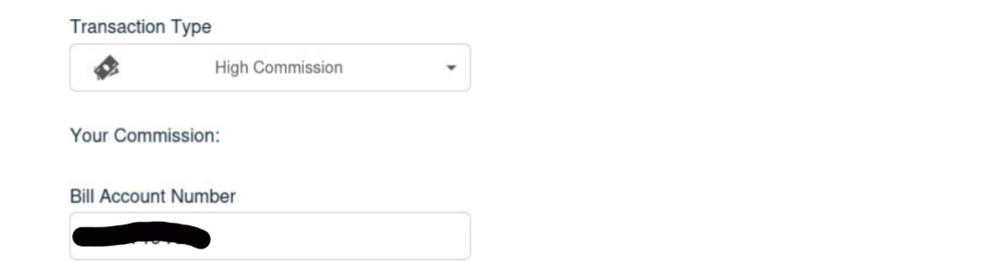
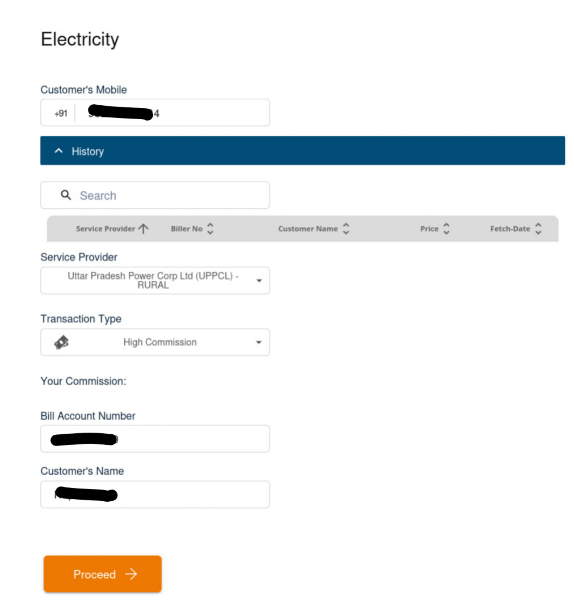
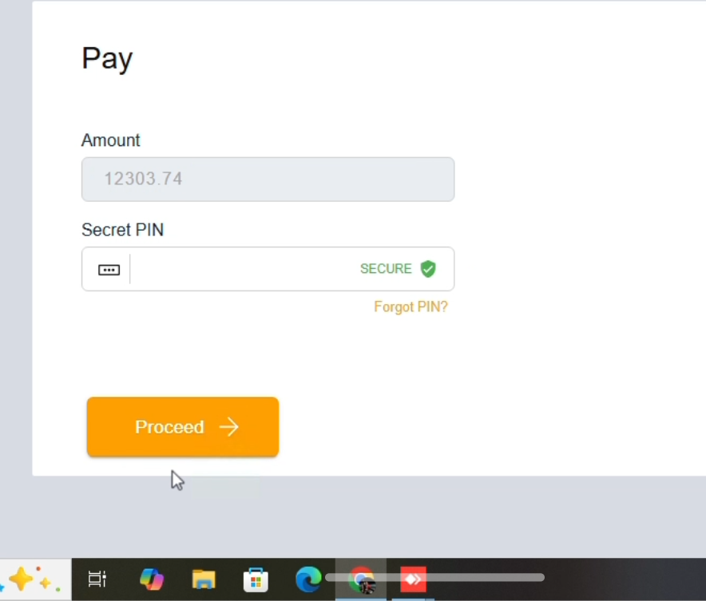

## Retailer Enters Customer Details

- The **retailer** begins by entering the **customer's mobile number**.  
  This number should be the one linked to the customer's electricity account.

- A **History section** will be visible, displaying records of previously paid bills based on the information provided on this page.

- The **retailer** then selects the appropriate **Service Provider** from the dropdown, as informed by the customer (e.g., UPPCL, TSSPDCL, BSES, etc.).

- Next, the **retailer** chooses the **Transaction Type**:
  - **Instant commission**: The payment is processed immediately, ensuring real-time confirmation. This option typically carries a lower commission.
  - **High Commission**: May take slightly longer to reflect, but offers a higher commission to the retailer.
  - **Note**: The High Commission option is only available when the bill amount exceeds ₹3000. 

- The **Bill Account Number** is then entered by the **retailer**.  
  This is the customer's unique identifier (such as a Consumer ID or CA Number) for electricity bill payments.
  

- The **retailer** also enters the **Customer’s Name** as per the details on the electricity bill.

- After verifying all entries, the **retailer** clicks on **Proceed** to fetch the bill details.
  

## Bill Payment Authorization

- After the bill details are fetched, the next screen will show the **Amount** to be paid.  
  This amount is **auto-filled by the system** based on the bill information fetched.

- The **retailer** then enters their **4-digit secret PIN** to authorize the transaction.

- Once the PIN is entered, the **retailer** clicks on the **Proceed** button.

  

## Transaction Success Screen

- Upon successful payment, a **Transaction Successful** screen will be displayed.

- The **retailer** can view and, if required, download or share the **payment receipt** from this screen.

## Key Points 

- Always enter the **customer’s registered mobile number** correctly to fetch accurate bill details.
- Ensure the **correct service provider** is selected based on the customer’s information.
- Choose the appropriate **Transaction Type**:
  - **Instant Pay** – Fast processing, lower commission.
  - **High Commission** – Higher commission, available **only if the bill amount exceeds ₹3000**.
- Double-check the **Bill Account Number** before proceeding.
- The **Customer’s Name** must match the name linked to the bill account.
- On the payment screen, the **bill amount is auto-fetched**; the retailer only needs to enter the **4-digit secret PIN**.
- The **History section** will display previous bill transactions linked to the information provided.

