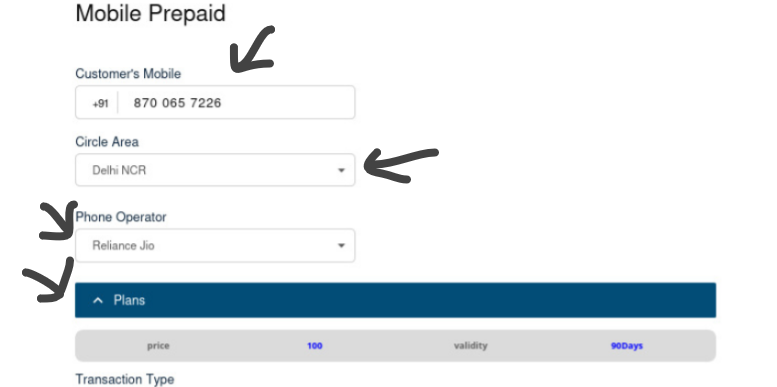
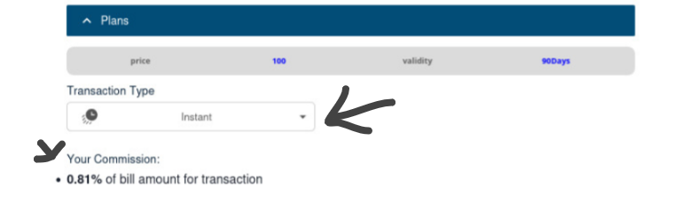

## Start Prepaid Mobile Recharge

### Step 1: Enter the Customer’s Mobile Number

* retailer enters the customer’s mobile number in the input field.  
* The system automatically detects and fills the circle/area and operator based on the mobile number.  
* The retailer must confirm with the customer whether the operator shown is correct.  
* If incorrect, the retailer can manually select the correct operator from the drop-down menu.  
* Based on the selected operator, the available recharge plans will be displayed.  

### Step 2: Choose Transaction Type

* In the Transaction Type section (meant for the retailer only), the retailer must choose one of the following options from the drop-down menu:  
  * High Commission – Applicable only for recharge amounts of ₹3000 or above.
  * Instant Commission – Commission is credited instantly but is lower.

### Step 3: Enter the Recharge Amount

* In the Amount section, the retailer inputs the exact recharge amount that corresponds with the chosen plan.  
* This amount must match the one specified by the operator for that particular recharge plan.

### Step 4: Confirm Recharge

* The retailer enters their secret PIN in the designated field.  
* Click Proceed to initiate the transaction.

---

## Recharge Confirmation Screen

### Step 1: View Recharge Summary

Once the transaction is successful, the confirmation screen will show the following details:

* Recharge Amount  
* Customer Convenience Fee  
* TDS  
* Total Amount  
* TID (Transaction ID)  
* Bill Account Number  
* Service Provider  
* Payment Method  
* Payment Channel  
* Commission Earned  
* Retailer Wallet Balance  
* Transaction Time

---

## Key Points 

1. The retailer must always confirm the operator with the customer.  
2. High Commission is only available for recharges of ₹3000 or more.  
3. Recharge amount must exactly match the plan value from the operator.  
4. A valid retailer PIN is mandatory to proceed with the recharge.  
5. Always review the transaction summary to ensure all details are correct.
