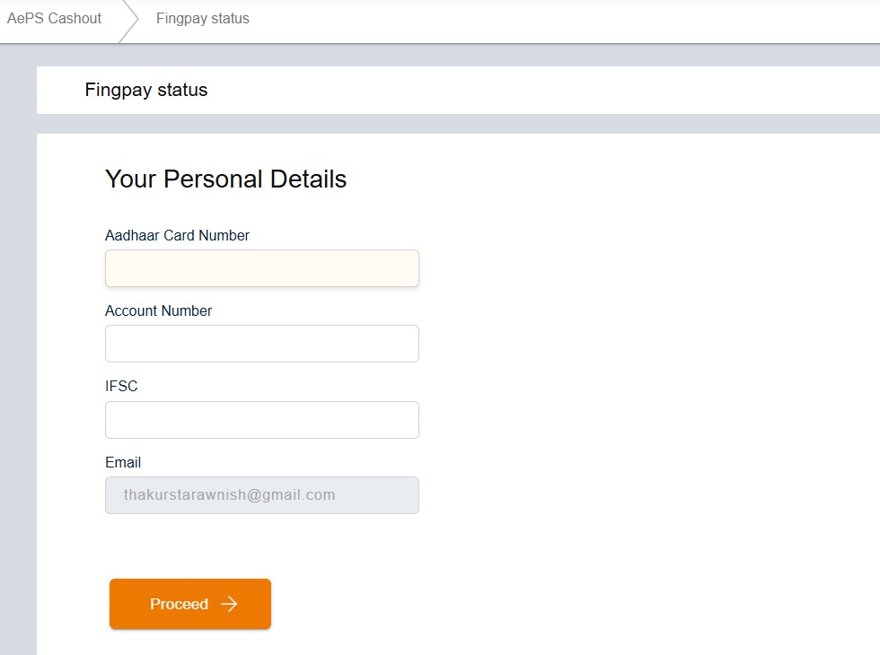
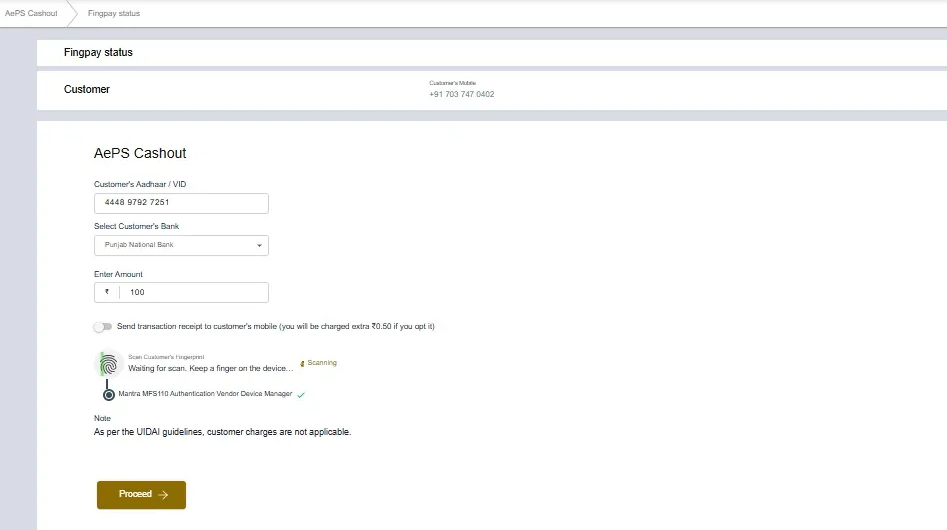

## 1. Retailer Registration for AEPS / AadhaarPay

### Step 1: Enter Personal Details

- Enter **Aadhaar Number**  
- Enter **Bank Account Number**  
- Enter **IFSC Code**  
- Enter **Email Address**  

### Step 2: Enter Address and Shop Details

- Fill **Residential Address** (Address Line 1, Address Line 2, City, State, Pincode)

- Select whether **Business Address is same as Residential**  
- If different, fill **Business Address**  (Business Address Line 1, Business Address Line 2, City, State, Pincode)
- Select **Shop Type / Business Category**  
- Click **Proceed**  

### Step 3: Register Biometric Device

- Option 1: **Enter Serial Number** manually 

- Option 2: **Detect Device Automatically**  
 
- Note: Make sure that **biometric device is connected and drivers are installed**  

### Step 4: Confirm Registration

- System will verify and display: **“AEPS Registration Successful”**  

## 2. AEPS / AadhaarPay Transaction Process

### Step 1: Daily eKYC for Retailer

- Enter **Retailer Aadhaar Number / VID**  
- Select **Bank Account**  
- Scan **Fingerprint** using biometric device  

### Step 2: Enter Customer Details

- Type **Customer’s Mobile Number**  
- Click **Proceed**  

### Step 3: Select Transaction Type

- Choose one of the following:  
  - **Cash Withdrawal**  
  - **Mini Statement**  
  - **Balance Inquiry**  

### Step 4: Transaction Process or Cash Withdrawal 

- Enter **Customer Aadhaar Number / VID**  
- Select **Customer’s Bank Name**  
- Enter **Amount** to withdraw  
- Scan **Customer’s Fingerprint**  
- (Optional) Trigger to **Send Receipt via SMS**  
- Click **Proceed**  

## 3. Key Points to Remember

- Retailer must complete **daily eKYC** before starting the transaction 
- Customer Aadhaar must be **linked with bank account**  
- Use only **registered biometric device**  
- **SMS receipt option** is chargeable (₹0.50 per transaction) 
- Kindly do not use L0 devices for biometric authentication 

