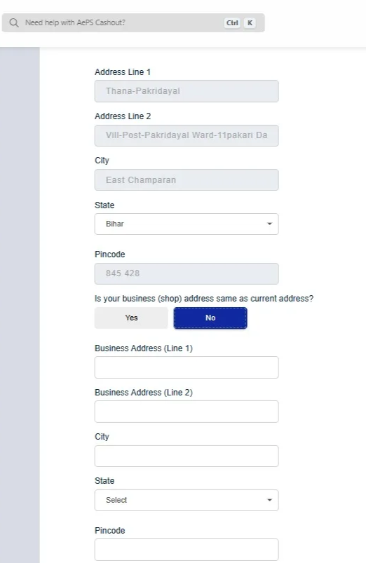
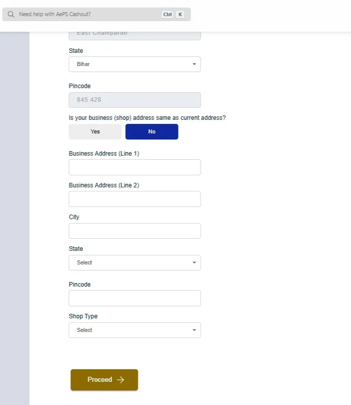
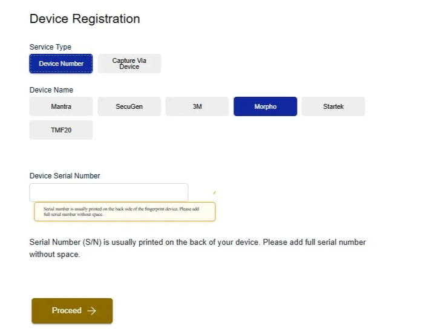
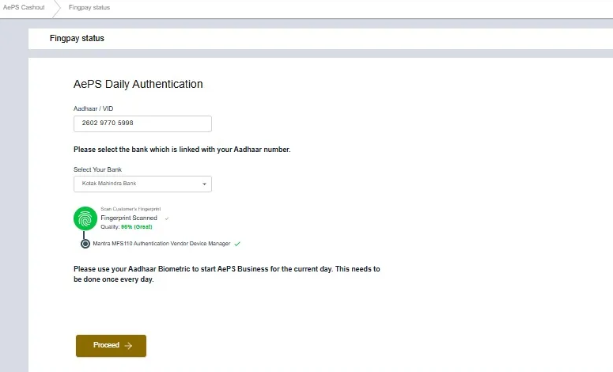
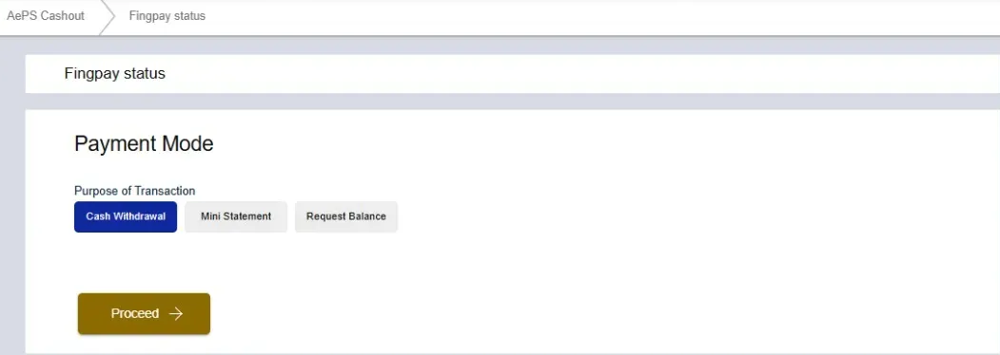

## What is AePS & AadhaarPay?

### AePS (Aadhaar Enabled Payment System)
AePS is a payment system that allows customers to make transactions using their Aadhaar number and biometric authentication. It enables cash withdrawals, balance inquiries, and mini statements through a network of agents or retailers.

Customers can access their bank accounts and perform transactions without the need for a physical debit card or PIN. AePS is particularly useful in rural and semi-urban areas where banking infrastructure may be limited.

For the "Cash Withdrawal" transaction, the amount will be transferred from the customer's bank account to the retailer's E-value wallet balance. The retailer can then hand over the equivalent cash to the customer.

### AadhaarPay
AadhaarPay is a payment solution that allows merchants to accept payments directly from customers' bank accounts using their Aadhaar number and biometric authentication. It enables cashless transactions, making it easier for retailers to conduct business without the need for cash or cards.

In this transaction, the amount is transferred from the customer's bank account directly to the retailer's registered bank account. Retailer can register their bank account during the AadhaarPay Rioueegistration process.

## How to Register for AePS/AadhaarPay?
The agent/retailer must complete a _one-time_ registration process to use AePS or AadhaarPay services.

- The registration process will start automatically when the retailer tries to use the AePS or AadhaarPay service for the first time.
- The retailer must have a registered biometric device to complete the registration process.

The registration process is as follows:

### Step 1: Enter Personal Details

- Enter **Aadhaar Number**
- Enter **Bank Account Number**
- Enter **IFSC Code**
- Enter **Email Address**

### Step 2: Enter Address and Shop Details

- Fill **Residential Address** (Address Line 1, Address Line 2, City, State, Pincode)

- Select whether **Business Address is same as Residential**
- If different, fill **Business Address**  (Business Address Line 1, Business Address Line 2, City, State, Pincode)
- Select **Shop Type / Business Category**
- Click **Proceed**

### Step 3: Register Biometric Device

- Option 1: **Enter Serial Number** manually

- Option 2: **Detect Device Automatically**

- Note: Make sure that **biometric device is connected and drivers are installed**

### Step 4: Confirm Registration

- System will verify and display: **“AEPS Registration Successful”**

## How to do AePS/AadhaarPay Transaction?

### Step 1: Daily eKYC for Retailer

The retailer/agent must complete **daily eKYC** every day before starting any transaction. This is a mandatory step to ensure the security and authenticity of the transactions.

- Enter **Retailer's Aadhaar Number / VID**
- Select **Bank Account**
- Retailer should scan their **Fingerprint** using the biometric device

### Step 2: Enter Customer Details

- Type **Customer’s Mobile Number**
- Click **Proceed**

### Step 3: Select Transaction Type

- For _AePS_ transaction, you need to choose one of the following:
  - **Cash Withdrawal**
  - **Mini Statement**
  - **Balance Inquiry**
- For _AadhaarPay_ transaction, no need to select transaction type. It will always be a payment transaction (customer pays to the retailer). Just click **Proceed**.

### Step 4: Transaction Process or Cash Withdrawal

- Enter **Customer Aadhaar Number / VID**
- Select **Customer’s Bank Name**
- Enter **Amount** to withdraw
- Scan **Customer’s Fingerprint**
- You may click the toggle-button to optionally **Send Receipt via SMS to the customer**. Note that this option is chargeable (₹0.50 per transaction).
- Click **Proceed**

## 3. Key Points to Remember

- Retailer must complete **daily eKYC** before starting the transaction every day
- Customer's Aadhaar must be **linked with their bank account**
- Use only **registered biometric device**
- **SMS receipt option** is chargeable (₹0.50 per transaction)
- Kindly do not use the old L0 devices for biometric authentication
