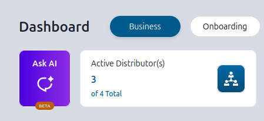
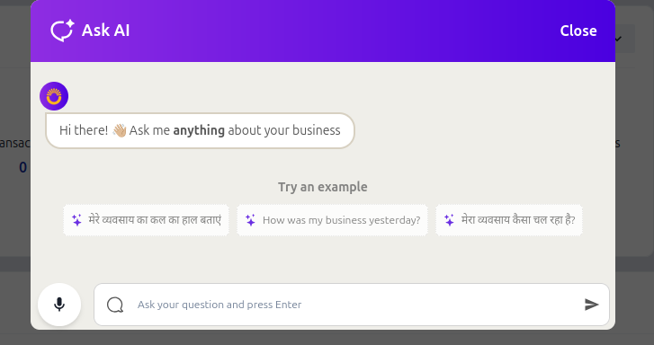
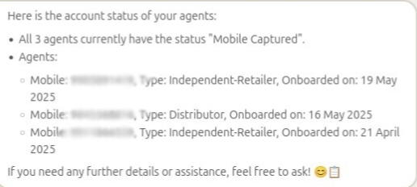
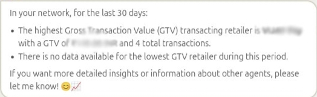
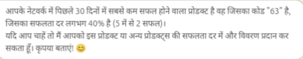
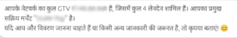
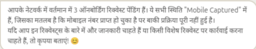
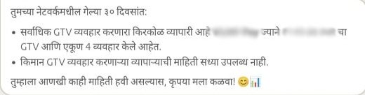
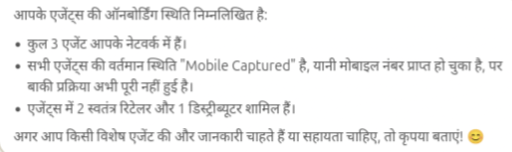

## What is AI Chatbot?

AI Chatbot is an intelligent assistant integrated into your Admin portal, designed to help you with business-related queries. You can interact with the chatbot either by typing or by speaking to the chatbot. It provides responses instantly, making it easier to access data like transactions, earnings, onboarding, and network performance.

### Multilingual and Voice Support
- The chatbot supports all Indian languages, including English and Hindi.
- Voice input is also supported in any language. Just ask your question verbally and receive responses your language.

---

## How to Use the Chatbot?

Goto to Business Dashboard and click on "Ask AI" card at the top of the page.

The chatbot will open on the screen, inviting you to ask anything about your business. The chatbot screen includes suggested example queries, which you can click to get started.

To directly talk to the chatbot, click on the "mic" icon on the bottom-left of the chatbot screen. 

---

## Example Questions You Can Ask the Chatbot

| Sample Question | Sample Response Screenshot|
| --- | --- |
| What is the account status of my agents? |  |
| Who is the highest and lowest GTV transacting retailer in my network in the last 30 days? |  |
| मेरे नेटवर्क में पिछले 30 दिनों में सबसे कम सफल होने वाला प्रोडक्ट कौन सा है? |   |
| Mera total GTV kitna hai? |   |
| How many onboarding requests are still pending in my network? |   |
| माझ्या नेटवर्कमधील सर्वाधिक आणि किमान GTV व्यवहार करणारा किरकोळ व्यापारी कोण आहे गेल्या ३० दिवसांत? |   |
| मेरे एजेंट्स की ऑनबोर्डिंग स्थिति क्या है? |   |

You can ask these in any language and in either text or voice format.

### More Sample Questions
1. How many transactions have been made in last 30 days?
2. What is my success percentage for fund transfer in last 30 days?
3. गेल्या ३० दिवसांत माझ्याकडे किती व्यवहार करणारे एजंट्स आहेत?
5. आपके नेटवर्क द्वारा उत्पन्न किया जा रहा वर्तमान लाभ मार्जिन क्या है?

---

## Disclaimer

Responses from the AI chatbot are generated using artificial intelligence. While the system aims to be accurate, please ensure that you verify any sensitive, financial, or business-critical information independently before taking action based on the chatbot’s output.
