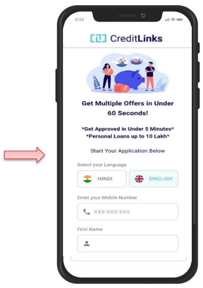

## What is CreditLinks?

**CreditLinks** provides two main services: 

1. Business Loans, and,
2. Personal Loans

Based on the user's personal and financial details, it matches them with suitable loan offers from various lending partners. The platform helps users compare, choose, and apply for loans quickly and conveniently.

## How to open CreditLinks?

1. Click on **Lending and Insurance** option in sidebar and then select **CreditLinks** option.

2. Then, click on the **Go to CreditLinks Portal** option to redirect to the CreditLinks webpage

---

## 1. How to avail Personal Loan?

### Step 1: Select Personal Loans option
- Click on Personal Loans option within CreditLinks webpage

### Step 2: Start Registration for Personal Loan
- Choose **Language**: Hindi or English.
- Enter your **Mobile Number** and **First Name**.
- Tap **Continue**.
- Enter the **OTP** received on the mobile number enterred.

### Step 3: Enter Personal Details
1. Personal Info:
- **First Name**, **Last Name**
- **PAN Number**
- **Birth Date**

2. Contact Information:
- **Email Address**
- **Mobile Number**
- **PIN Code**
- **City**

### Step 4: Select One of the Available Loan Offers
- Check loan offers available from lenders like **ICICI**, **CASHe**, **LendingKart**, etc., based on customer eligibility
- View **maximum amount** and tap **Details** for more info.
- Tap **APPLY** on your preferred lender.

### Step 5: Finalize Application
- Review details & complete any payment.
- Submit final loan application.

---

## 2. How to avail Business Loan?

### Step 1: Select Business Loans option
Click on Business Loans option within CreditLinks webpage.

### Step 2: Start Registration for Business Loan
- Choose **Language**: Hindi or English.
- Enter your **Mobile Number** and **First Name**.
- Tap **Continue**.
- Enter the **OTP** received on the mobile number enterred.

### Step 3: Enter Personal Details
1. Personal Information:
- **First Name**
- **Last Name**
- **Gender**
- **PAN Number**
- **Birth Date**

2. Contact Information:
- **Email Address**
- **Mobile Number**
- **City**
- **State**
- **Residence Type**

3. Employment Details:
- Select **Employment Status**
- Input **Desired Loan Amount**
- Choose Communication Preference i.e SMS/Email/Both
- Click on **Continue** to proceed further.

### Step 4: Fill in the GST Number Detail
1. For customers with no GST Number, click on **NO** for getting personal loan within the Business Loan Category

2. For customers with GST Number, click on **Yes** and enter the GST Number.

### Step 5: View & Select from Available Loan Offers
- Check loan offers available from lenders like **ICICI**, **CASHe**, **LendingKart**, etc., based on customer eligibility
- View **maximum amount** and tap **Details** for more info.
- Tap **APPLY** on your preferred lender.

### Step 6: Finalize Application
- Review details & complete any payment.
- Submit final loan application.
