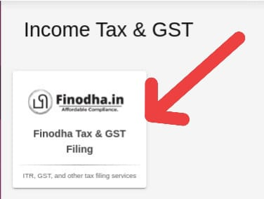
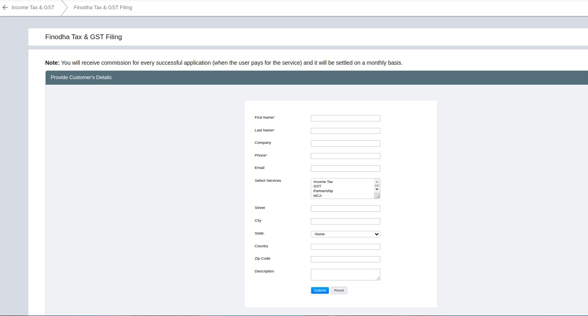

## Services offered by Finodha

Finodha offers tax, compliance, and business registration services in India, including Income Tax, GST, MCA filings, MSME registration, PAN/TAN services, and support for trusts, NGOs, and corporate entities.

- **Incoome Tax:** A hassle-free income tax return filing service where Finodha’s experts handle everything—from data collection to submission—ensuring fast, accurate, and compliant ITR filing.

- **GST:** Affordable and expert-backed GST registration and return filing service, ensuring error-free compliance within 3 working days.

- **Partnership:**
Provides fast and affordable partnership firm registration with PAN, deed, and tax filing support.

- **MCA:**
Offers company registration and ROC compliance under the Ministry of Corporate Affairs.

- **Director:**
Assists with DIN application, KYC, appointments, and other director compliance services.

- **Digital Signature:**
Provides Class 3 DSCs (Digital Signature Certificates) for secure e-filing on government and tendering platforms.

- **MSME/Udyog Aadhar/Udyam:**
Offers hassle-free and affordable MSME/Udyam/Udyog Aadhar registration, helping businesses access government benefits, subsidies, loans, and other incentives.

- **PAN-TAN:**
PAN/TAN application and compliance for individuals and businesses, essential for income tax filings and TDS compliance, ensuring hassle-free documentation and expert support.

- **Import-Export:**
Offers IEC (Import-Export Code) registration and compliance services to support international trade.

- **Miscellaneous:**
Support for transitional provisions, CGST Act clarifications, refund issues under previous tax laws, and special compliance needs.

- **Professional Tax:**
Offers professional tax registration and return filing across eligible states.

- **Trust/NGO/Society/Microfinance/Nidhi:**
Complete support for registration and regulatory compliance for charitable and financial organizations.

## How to avail these services from Finodha?

### Step 1: Click on Finodha Income Tax & GST

- Go to the Finodha platform.
- Locate the **Income Tax & GST** section.
- Click on the section to begin the submission process.

### Step 2: Fill in the form

You will be redirected to a form page. The form contains the following fields:

  - **First Name**
  - **Last Name**
  - **Company**
  - **Phone**
  - **Email**
  - **Select one or more services** _(by holding the `Ctrl` key)_ which you are interested in:  
    - Income Tax  
    - GST  
    - Partnership  
    - MCA
    - Director
    - Digital Signature
    - MSME/Udyog Aadhar/udyam
    - PAN-TAN
    - Import-Export
    - Miscellaneous
    - professional Tax
    - Trust/NGO/Society/Microfinance/Nidhi

  - **Street**
  - **City**
  - **State**  
    - Use the dropdown list to select your state (e.g., Maharashtra, Delhi)
  - **Country**
  - **Zip Code**
  - **Description**

**NOTE:** Use valid and active contact details to ensure you receive timely updates.

### Step 3: Submit the form

- After reviewing your inputs, click the **Submit** button.
- A confirmation message will appear on-screen.
- Finodha team will contact you either on your registered email or your mobile number.

## FAQs

### How will I receive my Commission?
You will receive commission for every successful application (when the user pays for the service), which will be settled on a monthly basis into your E-value balance.

### How will I receive updates after submitting the form?
Finodha team will send updates either to your registered email or mobile number, based on what you entered in the form.

### Can I submit the form for both Income Tax and GST together?
Yes, you can select multiple services like **Income Tax**, **GST**, **Partnership**, and **MCA** at the same time.

### What if I don’t receive any update?
Ensure your contact details were entered correctly. If the issue persists, contact Finodha support.
