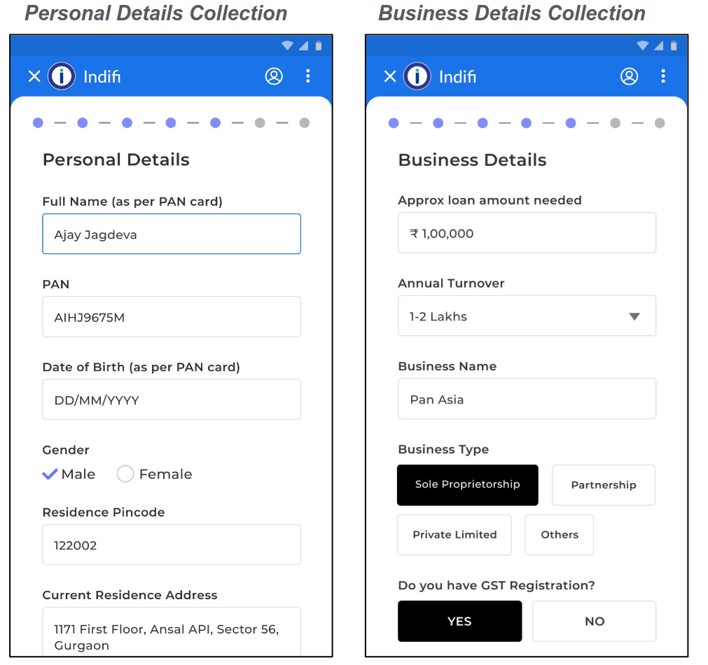
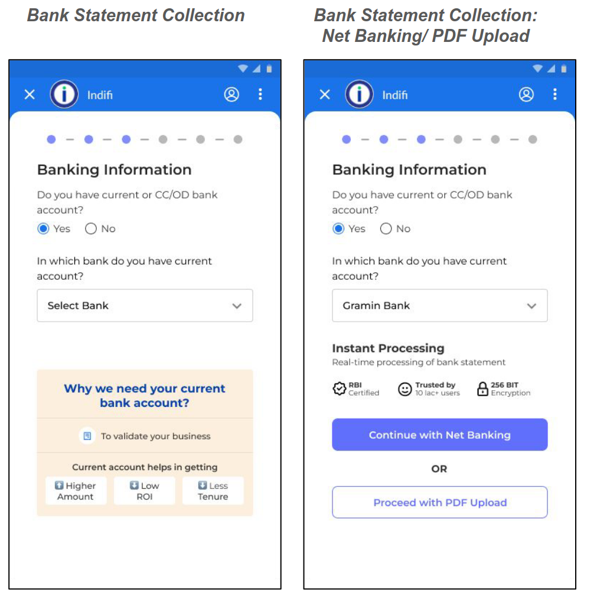
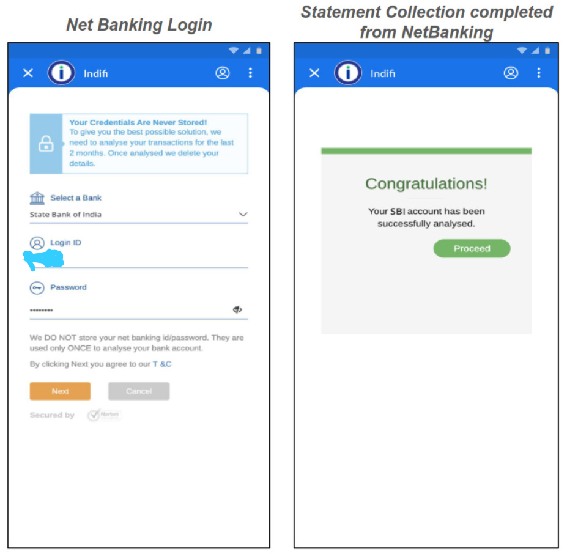

To apply for a loan through Fundfina, follow these steps:

## Step 1: Provide Personal and Business Details

### 1. Personal Information

Provide your personal details for the loan application. Ensure all information is accurate and matches your official documents.

- **Full Name:** Enter your full name as it appears on your PAN card (e.g., Ajay Sharma).
- **PAN Number:** Your 10-digit PAN number (e.g., ABCDE1234F).
- **Date of Birth:** DD/MM/YYYY format (must match PAN records).
- **Gender:** Select Male or Female.
- **Residence Address:** Full address with 6-digit postal code (e.g., Sector 62, Noida – 201301).

### 2. Business Details

- **Loan Amount Needed:** Enter the required amount (e.g., ₹5,00,000).
- **Annual Turnover:** Select from:
  - Below ₹10 lakhs
  - ₹10–25 lakhs
  - ₹25–50 lakhs
  - Above ₹50 lakhs
- **Business Name:** Legal registered name (e.g., Global Traders).
- **Business Type:** Select Sole Proprietorship, Private Limited, or Others.
- **GST Registration:** Select Yes (auto-fills GST details) or No.

## Step 2: Verify Your Bank Account

### 1. Account Type Selection

- Question: Do you have a Current or CC/OD account?
    - Select Yes (recommended for lower interest rates) or No.
- If Yes:
    - Choose Bank: Select from dropdown (e.g., HDFC, SBI).
    - Verification Methods:
        - Net Banking (instant)
        - PDF Upload (manual)
    - Select "Continue with Net Banking"
    - Select "Continue" again to proceed.

### 2. If you select, "Continue with Net banking":

#### 2.1 Mobile Verification

- Enter your bank-registered mobile number.
- Click Send Code → Enter the 6-digit code received.

#### 2.2 Select Linked Account

- All accounts linked to your mobile number are listed (e.g., HDFC Savings ••••5678).
- Select one account for loan processing.

#### 2.3 Approve Data Access

- For your chosen account, allow Fundfina to access 6–12 months of bank statements.
- Click Approve
- Enter verification code again, received on your registered mobile number.

#### 2.4 Net Banking Login

- You will be directed to your Bank specific login page
- Enter your Bank's Login ID and Password (case-sensitive).
- On the next screen a congratulations message will be shown then click on proceed

### 3. If you select, "Proceed with PDF Upload":

A new screen will appear if you select **PDF Upload** instead of Net Banking.

1. **Select Statement Period**
   - Choose the **Start Date** and **End Date** of the bank statements you want to upload.
        (E.g., Start: 01/01/2024, End: 30/06/2024)

2. **Choose Bank**
   - Select your bank from the dropdown (e.g., Axis Bank, ICICI).

3. **Select Account Type**
   - Choose **Current**, **CC/OD**, or **Savings**.

4. **Upload Statement PDF**
   - Click **Upload PDF** → Select the correct file from your device.
   - Please make sure that:
     - the file is clear and unedited.
     - it includes 6–12 months of transactions.
     - the file size is within the allowed limit.

5. **Submit File**
   - Click **Submit** to upload the PDF and proceed to the next step.

## Step 3: Submit Your KYC Documents

### 1. Promoter Documents

- Address Proof: Aadhaar, utility bill, or property tax receipt.
- PAN Card Scan: Clear colored copy.
- Photograph: Passport-sized (white background).
- National ID: Passport, driver’s license, or voter ID.

### 2. Business Documents

- Business Address Proof: GST certificate or lease agreement.
- Registration Document: Incorporation certificate or Udyam registration.

### 3. Additional Details

- Father’s Name: As per official records.
- Alternate Mobile Number: Verified via code.
- Business Industry: Auto-filled if linked to anchor data (editable).
- Industry Category: E.g., Retail, Manufacturing.

## Step 4: Review and Accept Fundfina Loan Offer

### 1. Loan Terms

- Amount After Deductions: Final disbursal amount.
- Duration: E.g., 12 months.
- Interest Rate: Monthly reducing basis (e.g., 1.5% p.m.).
- EMI: Monthly installment (e.g., ₹19,203).

### 2. Fundfina Loan Breakdown

- Processing Fees
- Insurance Premium
- Total Interest Payable
- Total Repayable Amount

Click **Accept Offer** to proceed.

## Step 5: eSign Fundfina Loan Agreement

### 1. eSign Screen

- If your mobile number is linked to your Aadhaar, click the "Proceed" button to eSign the loan agreement.
- If not linked, you will see an alternate option to proceed with the eSign process. In this case, you can sign the agreenment by capturing your selfie and verifying your obile number via an OTP.

### 2. Security Verification

- Enter the 6-digit code sent to your Aadhaar-linked mobile.
- Click Submit.

### 3. Business Loan Application Form

- Monthly Income: Enter approximate business earnings.
- Years in Operation: Years since registration.
- Click Sign Now.

### 4. Aadhaar Verification

- Check: I authorize NSDL to verify my Aadhaar.
- Enter 12-digit Aadhaar → Click Send OTP
- Enter the received code → Submit.

.

### 5. Confirmation

- Message: Document Signed Successfully
- Next: Automatic redirection to the next step.

## Step 6: Set Up Paperless Fundfina eMandate For Repayment

### 1. Select Payment Method

- Paperless eMandate (Recommended)
    - Automatically deduct EMIs from your bank account.
    - Action: Click “Set Up eMandate”.
- Sign ACH & Cheque
    - Manual process requiring physical document submission.

### 2. Review Mandate Summary

A summary screen will display:

- Name: Your registered name.
- Bank: Selected bank for auto-debit.
- Account Number: Masked for security (e.g., ••••5678).
- Maximum Amount: Approved EMI amount.
- Start Date: First EMI deduction date.
- End Date: Final deduction date (based on loan tenure).
- Frequency: Monthly.
- Purpose: "Loan EMI Repayment".
- Creditor Name: Lender’s banking partner.
- Creditor Code: Unique identifier.
- Reference ID: Your loan application ID.

Action:
- Verify details
- Click "Proceed"

### 3. Approve eMandate via Net Banking

Redirected to your bank’s secure portal.
Steps:

- Enter username and password.
- Review and approve the mandate request.

Note:
No funds are deducted during approval.

### 4. Confirmation

Success Message: "eMandate activated successfully! EMIs will auto-debit monthly."

## Step 7: Fundfina Disbursement Authorization & Final Confirmation

### 1. Disbursement Memo Screen

Title: Review Disbursement Details

**Details Displayed:**

- Disbursal Amount: Final amount credited to your account.
- Installment Dates:
    - Start Date: First EMI deduction date.
    - End Date: Final EMI deduction date.

**Fundfina Loan Breakdown:**

- Loan amount (principal)
- Processing fees
- Insurance charges
- Total interest payable
- Total Repayable: Principal + Interest + Charges

In Favor Of: Name of the financial institution.

**Action:**
- Review all details.
- Click “I Accept” at the bottom.

### 2. Final Confirmation Screen

Title: Application Successfully Submitted

Message:
Thank you for submitting your application!
No further action is required from your side.

