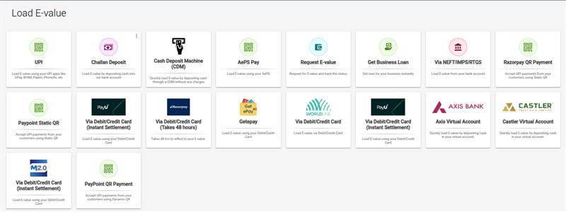
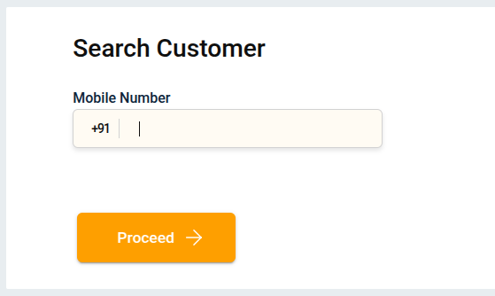
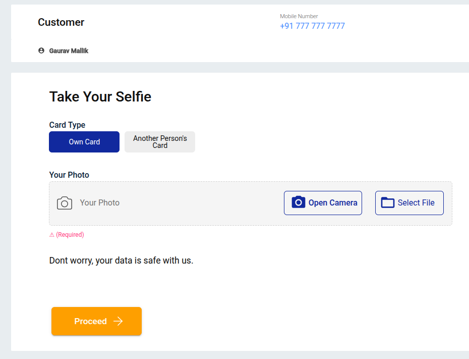
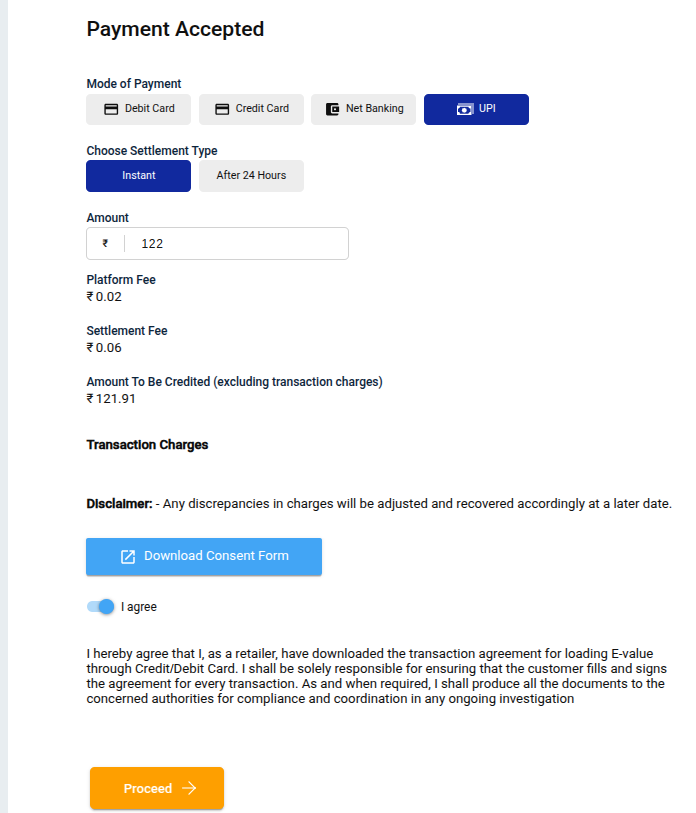
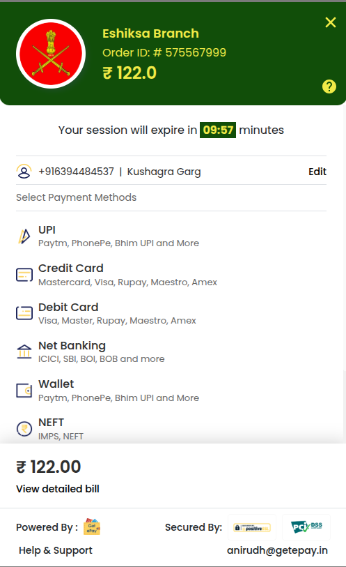
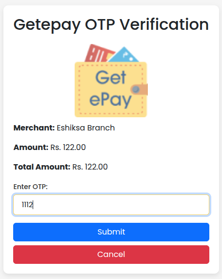
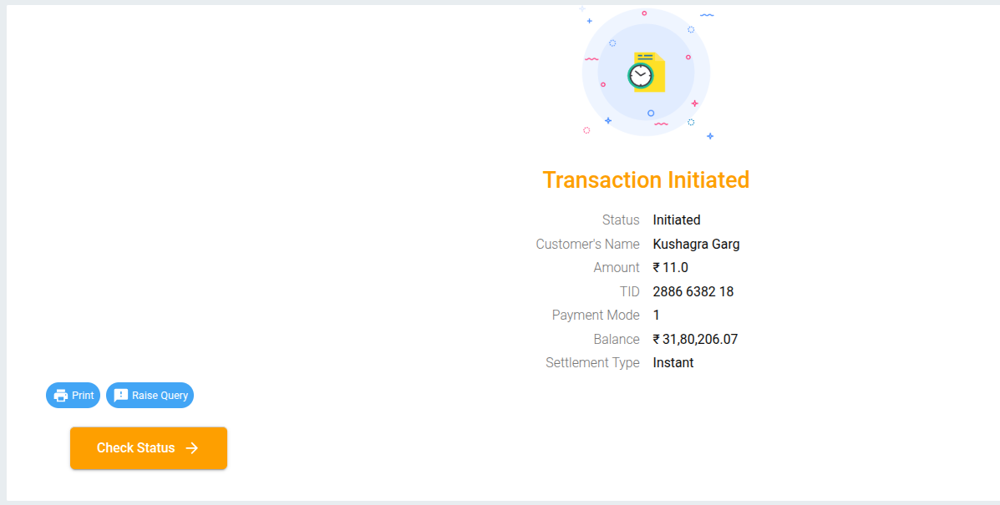

## What is E-Value?
E-Value is a prepaid balance or wallet used to process digital transactions within the platform.  
It allows users to perform quick and secure payments seamlessly.

E-Value transactions are processed through **Gatepay**, a secure payment gateway integrated within the system.  
Gatepay ensures smooth and instant fund transfers by connecting your wallet balance with multiple payment options such as **UPI**, **Net Banking**, and **Cards**.  
All E-Value loading and payment steps are handled safely within the Gatepay interface.
## How to do E-Value transactions?

### 1. Load E-Value
Start by loading the required E-Value for the transaction.  
Click on **Gatepay** — after that, the page shown below will appear.

---

### 2. Search Customer
After clicking **Gatepay**, the **Search Customer** page will open.  
Enter or search for the customer details to proceed.

---

### 3. Take Selfie
Capture a selfie for KYC or verification purposes.

---

### 4. Payment Accepted
Enter the payment details and click the **Proceed** button.

---

### 5. Redirection
A new payment page will open — select your preferred payment method (e.g., UPI, Net Banking, etc.) and click **Proceed**.

---

### 6. Enter OTP
Input the received OTP to complete the payment authentication and submit.

---

### 7. Return to Main App
You will be redirected back to the main application, where the transaction status will be displayed.

