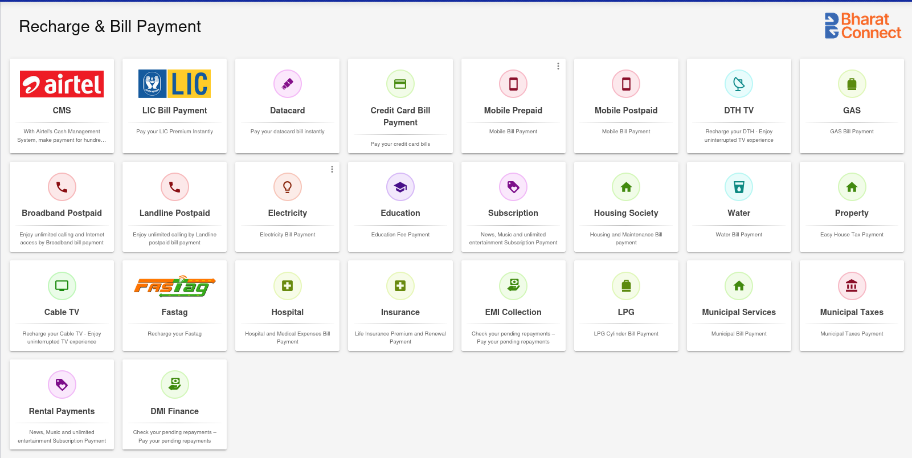
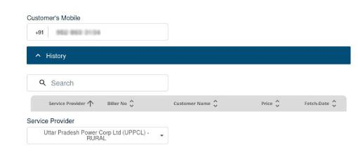
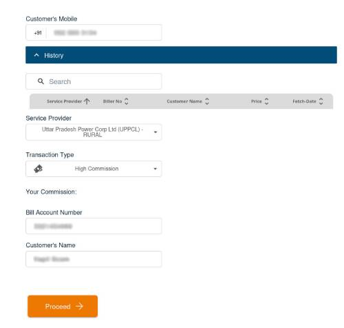
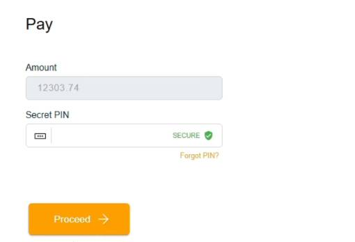

## What is BBPS Bill Payments?

The **Bharat Bill Payment System (BBPS)** is a service launched by the **Reserve Bank of India (RBI)** and operated by the **National Payments Corporation of India (NPCI)**. It facilitates seamless bill payments across various categories, including `electricity`, `telecom`, `DTH`, `gas`, `water`, and more.

## Step 1: Select a Bill Payment Category

First, select one of the following bill payment categories:
- Airtel CMS
- LIC Bill Payment
- Datacard
- Credit Card Bill Payment
- Mobile Prepaid
- Mobile Postpaid
- DTH TV
- GAS
- Broadband Postpaid
- Landline Postpaid
- Electricity
- Education
- Subscription
- Housing Society
- Water
- Property
- Cable TV
- Fastag
- Hospital
- Insurance
- EMI Collection
- LPG
- Municipal Services
- Municipal Taxes
- Rental Payments
- DMI Finance

**Note:** The following steps may be slightly different for each product. Steps like `History` or `Bill Fetch` may not be avaialble for all products.

## Step 2: Start Recharge and Bill Payment
- Enter the **customer's mobile number**.
- A **History** table shows only when the customer has made at least one prior payment. Otherwise, no previous payment details will be shown.
- If history is available, you may select a previous transaction entry to autofill the rest of the details.
- Otherwise, select the appropriate **Service Provider** from the dropdown, as requested by the customer.

- Choose the **Transaction Type**:
  - **Instant**: The payment is processed immediately, ensuring real-time confirmation. This option typically carries a lower commission.
  - **High Commission**: May take slightly longer to reflect, but offers a higher commission.
  - **Note**: The High Commission option is only available when the amount exceeds ₹3000.
- Enter the **Account Number**. This is the customer's unique identifier (such as a _Bill Number_ or _Consumer ID_ or _CA Number_) for bill payments.

  

- Enter the **Customer’s Name** as per the details on the bill.
- After verifying all entries, click on **Proceed** to fetch the payment details.

  

## Step 3: Make Payment

- After the details are fetched, the next screen will show the **Amount** to be paid. This amount is **auto-filled by the system** based on the payment information fetched.
- In case bill fetch is not available, kindly fill the bill amount manually.
- Enter the **4-digit secret PIN** to authorize the transaction.
- Then, click on the **Proceed** button.
- Upon successful payment, a **Transaction Successful** screen is displayed, with the details of the transaction.

  

## Key Points

- Ensure the **correct service provider** is selected based on the customer’s information.
- Choose the appropriate **Transaction Type**:
  - **Instant commission** – Fast processing, lower commission.
  - **High Commission** – Higher commission, available **only if the amount exceeds ₹3000**.
- Double-check the **Account Number** before proceeding.
- On the payment screen, the **amount is auto-fetched**; Only the **4-digit secret PIN needs to be entered.
- The **History** table will display previous bill payments for the customer, which can be selected to avoid typing the Account Number.
