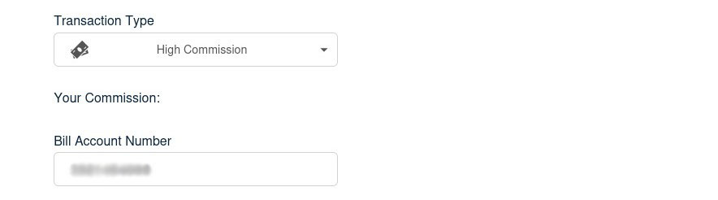

## What is BBPS Bill Payments?

The **Bharat Bill Payment System (BBPS)** is a service launched by the **Reserve Bank of India (RBI)** and operated by the **National Payments Corporation of India (NPCI)**. It facilitates seamless bill payments across various categories, including `electricity`, `telecom`, `DTH`, `gas`, `water`, and more.

## Step 1: Select a Bill Payment Category

## Step 1: Enter Customer Details

- The **retailer** begins by entering the **customer's mobile number**.
- A **History Dropdown** populates only when the customer has made at least one prior payment. Otherwise, no previous payment details will be shown.
- The retailer can select a previous transaction entry to autofill the rest of the details.
- Otherwise, select the appropriate **Service Provider** from the dropdown, as informed by the customer.

- Next, the **retailer** chooses the **Transaction Type**:
  - **Instant**: The payment is processed immediately, ensuring real-time confirmation. This option typically carries a lower commission.
  - **High Commission**: May take slightly longer to reflect, but offers a higher commission to the retailer.
  - **Note**: The High Commission option is only available when the amount exceeds ₹3000.
- The **Account Number** is then entered by the **retailer**.
  This is the customer's unique identifier (such as a Consumer ID or CA Number) for bill payments.

  

- The **retailer** also enters the **Customer’s Name** as per the details on the bill.
- After verifying all entries, the **retailer** clicks on **Proceed** to fetch the payment details.

  

## Step 2: Bill Payment

- After the details are fetched, the next screen will show the **Amount** to be paid.
  This amount is **auto-filled by the system** based on the payment information fetched.
- The **retailer** then enters their **4-digit secret PIN** to authorize the transaction.
- Once the PIN is entered, the **retailer** clicks on the **Proceed** button.

  

## Step 3: Transaction Success Screen

- Upon successful payment, a **Transaction Successful** screen is displayed, with the details of the transaction.

## Key Points

- Ensure the **correct service provider** is selected based on the customer’s information.
- Choose the appropriate **Transaction Type**:
  - **Instant commission** – Fast processing, lower commission.
  - **High Commission** – Higher commission, available **only if the amount exceeds ₹3000**.
- Double-check the **Account Number** before proceeding.
- On the payment screen, the **amount is auto-fetched**; the retailer only needs to enter the **4-digit secret PIN**.
- The **History Dropdown** will display previous transactions linked to the information provided, which can be selected to avoid typing the Account Number.
