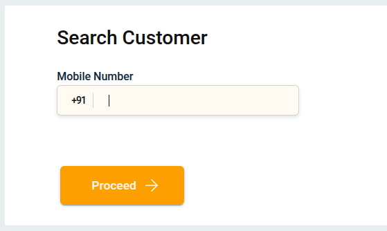

# How to load E-Value using Getepay Payment Gateway?

You can use **Getepay Payment Gateway** to load money into your **E-Value Wallet** using your **Credit/Debit Cards**, **Netbanking**, or any **UPI app**.

You can also use this service to **accept payments from your customers** through their **cards**, **Netbanking**, or **UPI app**.

## Steps to Load E-Value via Getepay Payment Gateway.

### 1. Choose the “Getepay Payment Gateway”

---

### 2. Search Customer

After clicking **Getepay Payment Gateway**, the **Search Customer** page will open.  
Enter the mobile number — either the customer’s or yours — depending on who is making the payment using their card, Netbanking or UPI app. 
Click on the **Proceed**.

---

### 3. Take Selfie

After completing the customer search, the **Take Selfie** page will open.  
Click on **Open Camera** and capture a clear selfie of the person who is making the payment using their card, Netbanking or UPI app. 
Once done, click on **Proceed** to continue.

---

### 4. Payment Accepted

Select the **Payment Method**.  
Enter the **Amount**.  
Click on **Proceed** to continue.

---

### 5. Redirection

A new payment page will open.  
Select your preferred payment method (e.g., **UPI, NetBanking, Debit/Creadit Card**, etc.).  
Click on **Proceed** to continue.

---

### 6. Enter OTP
Enter the **OTP** to complete authentication and click **Submit**.

---

### 7. Return to Load E-Value
After completing the payment through Getepay, you will be automatically redirected back to the Load E-Value section, where your transaction status will be displayed.

