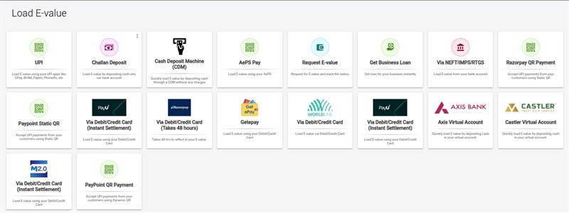
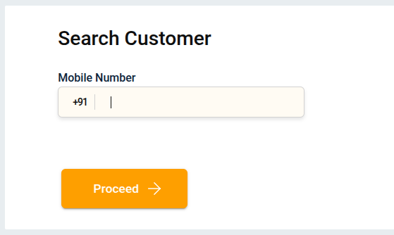
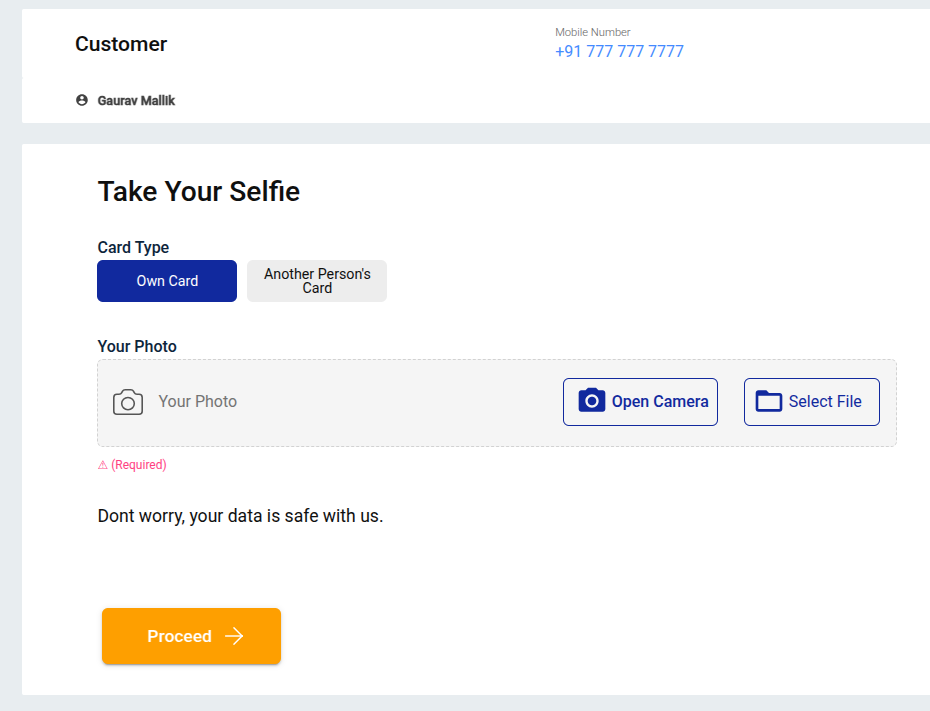
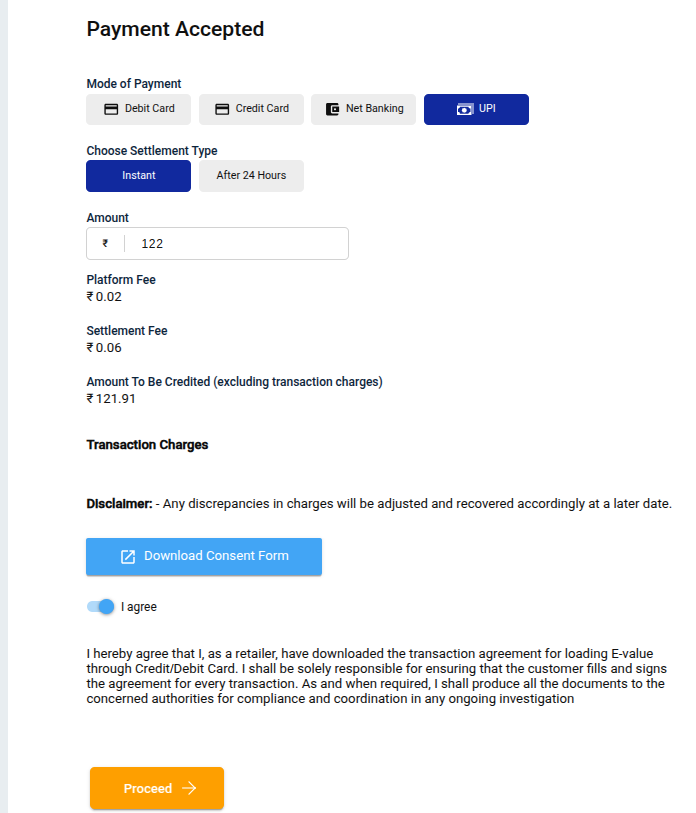
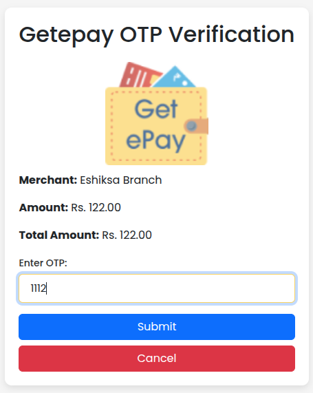
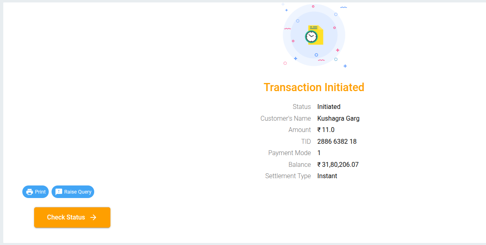

# How to load E-Value using GetePay Payment Gateway?

**GetePay** is a payment gateway used to upload funds into your **E-Value wallet** through various methods, such as **UPI, Net Banking, and Cards**.

## Steps to Load E-Value via GetePay Payment Gateway.

### 1. Choose the “GetePay Payment Gateway”

---

### 2. Search Customer

After clicking **GetePay Payment Gateway**, the **Search Customer** page will open.  
Enter the mobile number — it can be either the customer’s number or your own — depending on which card the amount will be deducted from.  
Click on the **Proceed**.

---

### 3. Take Selfie

After completing the customer search, the **Take Selfie** page will open.  
Click on **Open Camera** and capture a clear selfie of the person whose mobile number was entered in the **Search Customer**.  
Once done, click on **Proceed** to continue.

---

### 4. Payment Accepted

Select the **Payment Method**.  
Enter the **Amount**.  
Click on **Proceed** to continue.

---

### 5. Redirection

A new payment page will open.  
Select your preferred payment method (e.g., **UPI, Net Banking, Cards**, etc.).  
Click on **Proceed** to continue.

---

### 6. Enter OTP
Enter the **OTP** to complete authentication and click **Submit**.

---

### 7. Return to Load E-Value
After completing the payment through GetePay, you will be automatically redirected back to the Load E-Value section, where your transaction status will be displayed.

