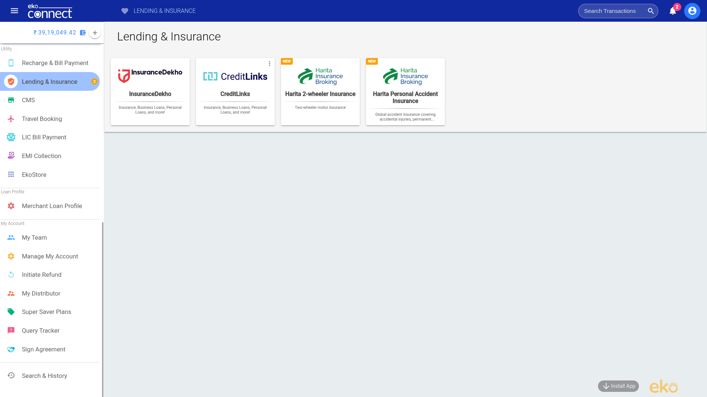
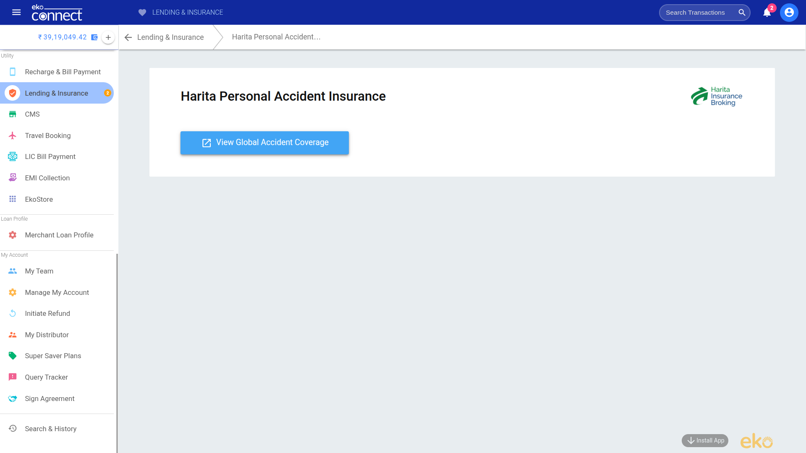
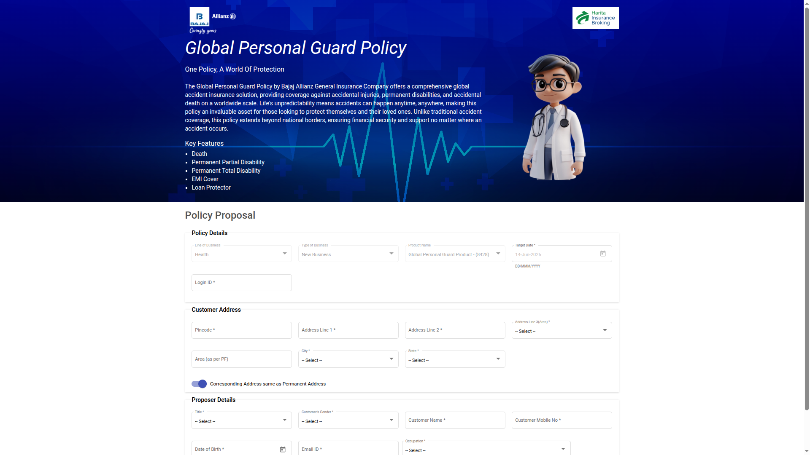

## What is Harita Personal Accident Insurance?

The **Global Personal Guard Policy** by **Bajaj Allianz General Insurance Company**, offered via **Harita Insurance Broking**, is a comprehensive global accident insurance product. It provides financial protection against accidental injuries, permanent disabilities, and death—worldwide.

This policy is ideal for individuals seeking coverage beyond national boundaries, offering security regardless of where an accident happens.

### **Key Features & Coverage:**
- **Death** 
- **Permanent Partial Disability**
- **Permanent Total Disability**
- **EMI Cover**
- **Loan Protector** 

## How to Buy Harita Personal Accident Insurance?

### Step 1: Go to Lending & Insurance Section
Navigate to **Lending & Insurance** section in the side menu within the portal. Then, click on **Harita Personal Accident Insurance**.

### Step 2: Go to Global Accident Coverage Page
After choosing the policy option, click on "View Global Accident Coverage" to open the **Global Personal Guard Policy** Form.

### Step 3: Fill the Policy Proposal Form
Fill in all required details across three main sections within the **Global Personal Guard Policy** Form:

1. Policy Details
- **Line of Business**: Select `Health`
- **Type of Business**: Choose `New Business`
- **Product Name**: Auto-filled as `Global Personal Guard Product - (8428)`
- **Target Date**: Choose intended policy start date
- **Login ID**: Enter valid Login ID provided by the portal

2. Customer Address
- **Pincode**
- **Address Line 1 & 2**
- **City**
- **State**
- **Address Line 3 (Area)**: Choose from dropdown
- Optionally check: `Corresponding Address same as Permanent Address`

3. Proposer Details
- **Title**: Mr., Ms., etc.
- **Date of Birth**
- **Gender**
- **Customer Name**
- **Customer Mobile Number**
- **Email ID**
- **Occupation**: Choose from the dropdown

### Step 4: Submit & Proceed to Payment

Once all details are filled:
1. **Review** the entered information carefully.
2. **Submit** the proposal.
3. **Make payment** using the available online payment modes to complete the insurance purchase.

## Key Points to Remember

- Ensure all address and personal details match your official ID documents.
- Double-check your **mobile number and email** for receiving policy updates.
- Note down or save the **Login ID** and **Policy Number** for future claims or queries.
- This policy offers global protection—ideal for frequent travelers or global professionals.
