## What are the Vehicle Insurance Services provided by Harita?
- **Harita Insurance** provides comprehensive private car and two wheeler (bike) insurance policies for the owner-driver within their vehicle insurance services.

- Policies can be enhanced with optional add-ons like **Zero Depreciation**, **Roadside Assistance**, **Engine Protector**, and **Return to Invoice**, allowing you to customize coverage to your specific needs.

## How to proceed to Harita Vehicle Insurance Page?

### Step 1: Go to Lending & Insurance Section
Navigate to **Lending & Insurance** section in the side menu within the portal. Then, click on **Harita 2-wheeler Insurance** option.

### Step 2: Register Email (One-Time Only)
You must update your email address, if you have not provided it before on this app.
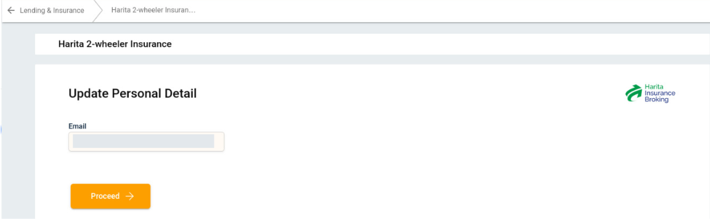

### Step 3: Go to Harita Vehice Insurance Page
Click on "Buy Insurance" option to navigate to the Harita Vehicle Insurance page.
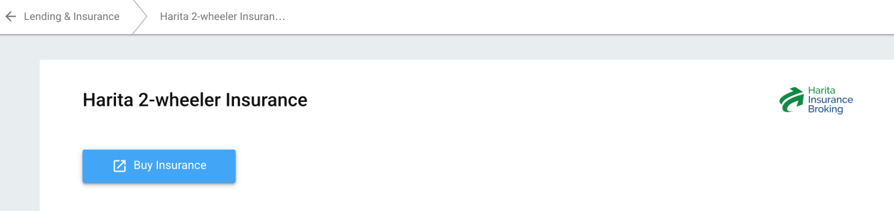

---

## How to Buy Two Wheeler (Bike) Insurance?

### Step 1: Select Two Wheeler Option
Start Booking Bike Insurance by selecting the **"Two Wheeler"** option

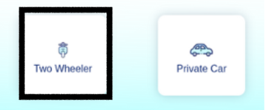

### Step 2: Enter Bike Registration Number
Start by entering the **Vehicle Registration Number** and click on **View Plans**.

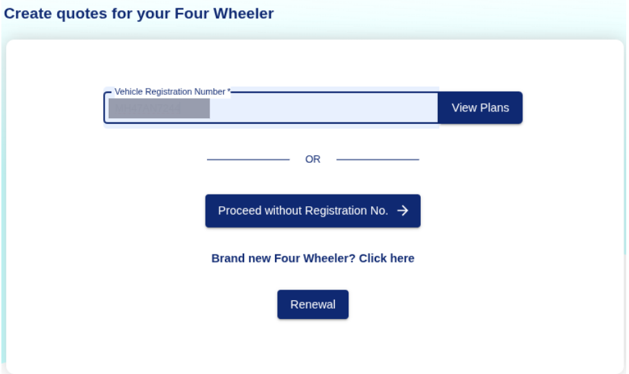

### Step 3: Enter Bike Details

1. Fill out the following fields:
   - **Make and model** of the bike
   - **Variant** of the vehicle
   - **RTO Location**
   - **Date of Registration**
   - **Policy Type**: Choose between *Comprehensive (1OD + 1TP)* or other options
   - **Previous Policy Details Known?** Yes / No
   - **Is it a used vehicle?** Yes / No
   - **Full Name**
   - **Mobile Number**

2. Click on **Get Quote**.

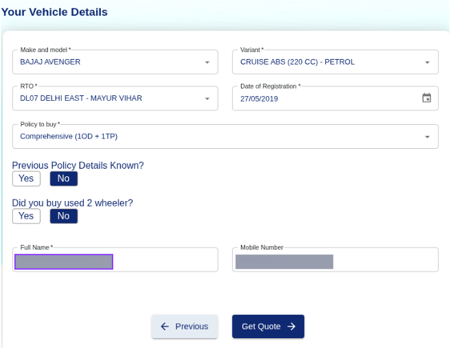

### Step 4: View Available Policy Plans
Compare the available policy plans shown based on your vehicle details. Choose one of the plans by clicking the **"Buy Now"** button.

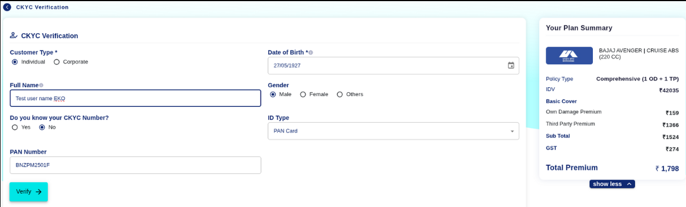

### Step 5: Complete CKYC Verification and Review Plan Summary

1. Fill in the CKYC verification form:
    - **Customer Type**: Select *Individual* or *Corporate*
    - **Full Name**
    - **PAN Number**
    - **Date of Birth**
    - **Gender**
    - **ID Type**: Select from dropdown

2. Review Plan Summary
Confirm these details and make sure all details are accurate before moving forward:
    - **Policy Type**
    - **Basic Cover Breakdown**
    - **Add-On Covers**
    - **Total Premium**

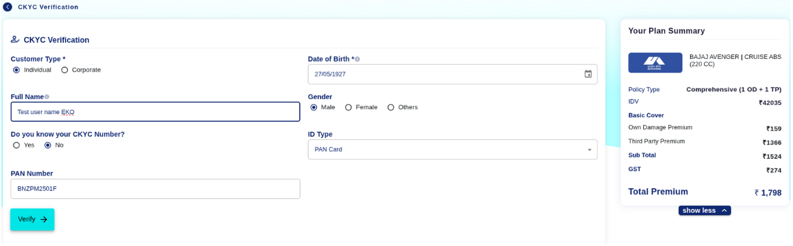

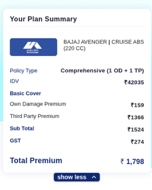

### Step 6: Complete Payment
Proceed to payment using available online payment options to finalize and purchase the policy.

---

## How to Buy Private Car Insurance?

### Step 1: Select Private Car Option
Start Booking Car Insurance by selecting the **"Private Car"** option.

### Step 2: Enter Car Registration Number
Start by entering the **Vehicle Registration Number** and click on **View Plans**.

### Step 3: Enter Car Details

1. Fill out the following fields:
    - **Make and model** of the car
    - **Variant** of the vehicle
    - **RTO Location**
    - **Date of Registration**
    - **Policy Type**: Choose between *Comprehensive (1OD + 1TP)* or other options
    - **Previous Policy Details Known?** Yes / No
    - **Is it a used vehicle?** Yes / No
    - **Full Name**
    - **Mobile Number**

2. Click on **Get Quote**.

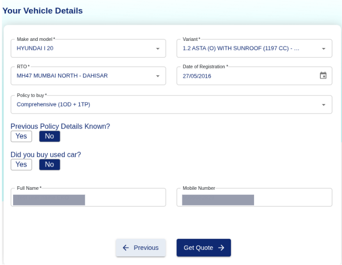

### Step 4: View Available Policy Plans
Compare the available policy plans shown based on your vehicle details. Choose one of the plans by clicking the **"Buy Now"** button.

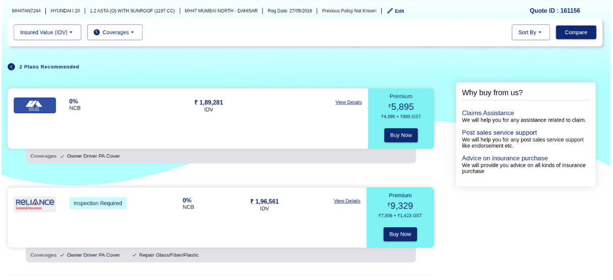

### Step 5: Complete CKYC Verification and Review Plan Summary

1. Fill in the CKYC verification form:
    - **Customer Type**: Select *Individual* or *Corporate*
    - **Full Name**
    - **PAN Number**
    - **Date of Birth**
    - **Gender**
    - **ID Type**: Select from dropdown

2. Review Plan Summary
Confirm these details and make sure all details are accurate before moving forward:
    - **Policy Type**
    - **Basic Cover Breakdown**
    - **Add-On Covers**
    - **Total Premium**

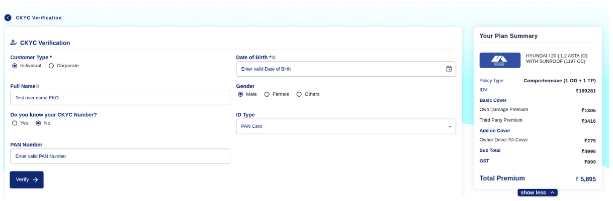

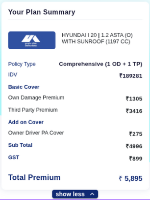

### Step 6: Complete Payment
Proceed to payment using available online payment options to finalize and purchase the policy.

## Key Points to Remember

- Ensure correct registration number to get accurate quotes.
- Always verify CKYC details before submission.
- Review IDV and coverage options before making payment.
- Keep a screenshot or PDF of the quote or policy for future reference.
