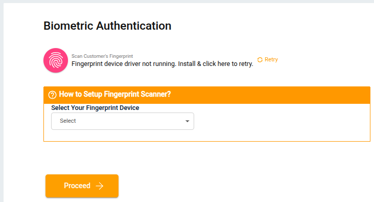
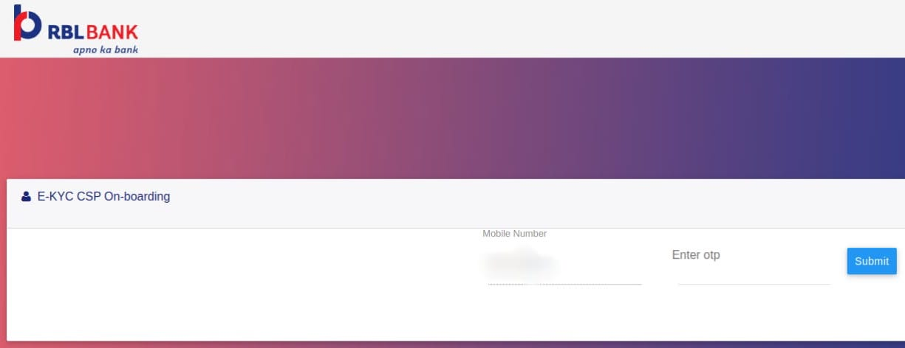

## What is Indo-Nepal Money Transfer?
Indo-Nepal Transfer is a cross-border remittance service that allows agents in India to send money to beneficiaries in Nepal securely and conveniently. The service ensures safe transactions, quick processing, and compliance with regulatory requirements.

---

## How to Register Yourself for Indo-Nepal Money Transfer?

To start using the Indo-Nepal Money Transfer service, you must first complete the **registration** and **KYC (Know Your Customer)** process.  

### Step 1: Click on **Indo-Nepal Transafer**
 
### Step 2: Update Profile

If you are not verified, or if any of your profile details are missing, the system will show the relevant profile update screen. 

Completed details will be auto-populated.

#### 1. Update Email

- Enter your **Email ID** and Click **Proceed** to continue to the next. 

#### 3. Update Alternate Number

- Enter your **Alternate Mobile Number** and Click **Proceed** to continue to the next.

 

- Enter the OTP sent to your Alternate Mobile Number, Click **Proceed** to continue to the next.

  

- Confirm  Your **Secret PIN** to proceed Next .  

#### 2. Personal Details
  
Enter Your Details

- Date of Birth  
- Gender  
- Father’s Name  
- Spouse Name *(Optional)*  
- Marital Status  
- Physically Handicapped (Yes/No)   
- Education Qualification *(Dropdown)*  
- Category *(General/OBC/SC/ST/etc.)*  

After filling in the details, Click **Proceed** to continue to the next.

#### 4. Personal Address Details

Enter Your Details

- Address Line 1
- Address Line 2
- Pincode
- City 
- District 
- State 

After filling details, Click **Proceed** to continue to the next.

#### 5. Business Details

Enter Your Details

- Shop Name  
- GST Number  
- Company Type *(Private Ltd / LLP / Proprietorship, etc.)*  
- Nature of Business *(Dropdown)*  
- Occupation Domain *(Govt / Private / Self Employed, etc.)*  
- Annual Income  
- Expected Annual Turnover  
- Mobile Number  

After filling details, Click **Proceed** to continue to the next.  

#### 6. Business Address Details

Enter Your Details

- Address Line 1
- Address Line 2
- Pincode
- City
- District
- State  

After filling details, Click **Proceed** to continue to the next. 

#### 7. Bank Details

Enter Your Details

- Select Your Bank *(Required)*  
- Enter Your Bank Account Number  
- Enter Your Name  
- Enter IFSC Code 

After filling details, Click **Proceed** to continue to the next.

#### 8. Sending OTP

- An OTP will be sent to the registered mobile number.  
- Enter OTP to complete verification.  
- Click **Proceed** to continue to the next.

Once verified, You will be becomes a **Verified Agent**.  

---

### Step 3: Initiate RBL KYC

- Click **Initiate RBL KYC** on the screen to complete the **KYC** process.
 

- Aadhaar-based KYC page will open. 
- Enter Aadhaar Number/VID (twice)  
- Enter Date of Birth & Gender  
- Accept terms & conditions  

- Click **Submit** → then **OK**  

 

After completing the **KYC**, click **Procced** button to continue.

---

### Step 4: Biometric Authentication

- Scan customer’s fingerprint using a supported device.  
 
- Click on the **Proceed** button to continue to the onboarding step.

- If onboarding fails, a **Tech Support ticket** is created automatically. 

- If onboarding is successful, the following card will be displayed. 
- Click on **Complete KYC with OTP**

---

### Step 5: E-KYC CSP Onboarding

- Enter **CSP Mobile Number**
- Click on **Send OTP**

- Enter OTP & Submit 

- Click on **Submit** button to continue

- On reaching **Thank You** screen → close the tab 

---

### Step 6: Click On Proceed
- After KYC is completed → Click **Proceed**  

- System redirects to **Search Customer** screen  

---

## How to Do Indo-Nepal Transfer Transactions?

Once your account is verified and active

1. Log in to the portal  
2. Select **Indo-Nepal Transfer**  
3. Enter beneficiary details:  
   - Full Name  
   - Mobile Number  
   - Bank Account Number *(if applicable)*  
   - Bank Name & Branch  
4. Enter transaction amount  
5. Review all details carefully  
6. Confirm & Proceed  
7. System generates a confirmation receipt  

---

## Key Points
- Agent verification & KYC are mandatory before transactions.  
- Ensure accurate beneficiary details to avoid delays/failures.  
- Keep transaction receipt for records.  

---

## FAQs

### What if profile update is required?
If agent details are not found during verification, system prompts **Update Profile** before proceeding.  

### How long does a transfer take?
Usually instant, but may take up to 24 hours depending on bank.  

### What if a transaction fails?
The amount is refunded back to the sender’s account within standard timelines.  
