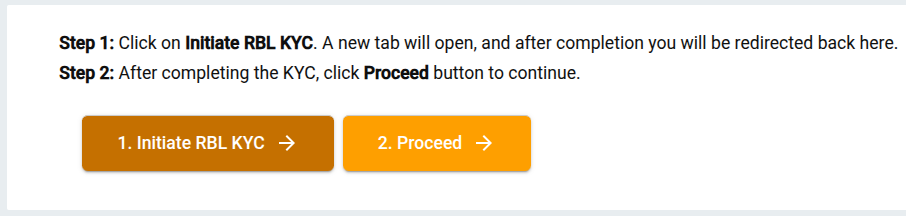
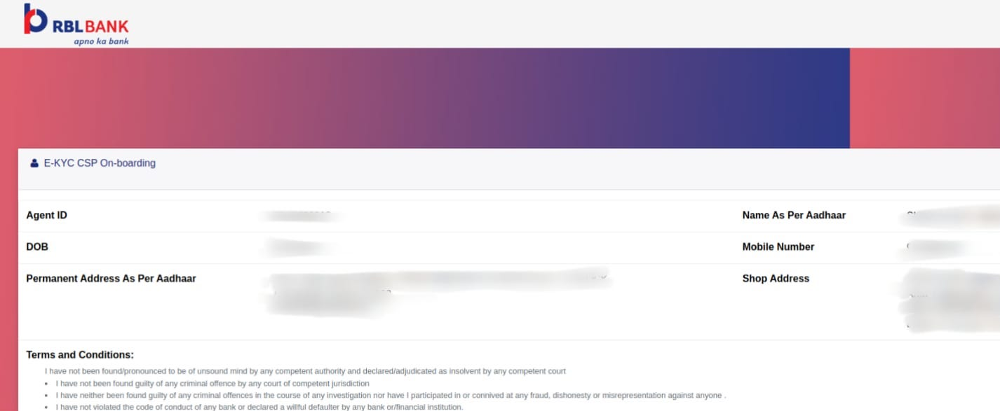

## What is Indo-Nepal Money Transfer?
Indo-Nepal is a cross-border remittance service that allows agents in India to send money to beneficiaries in Nepal securely and conveniently. The service ensures safe transactions, quick processing, and compliance with regulatory requirements.

---

## How to Register Yourself for Indo-Nepal Money Transfer?

To start using the Indo-Nepal Money Transfer service for your customers, you must first complete your **registration** and **KYC (Know Your Customer)** process.

### Step 1: Open **Indo-Nepal** from the left-menu

### Step 2: Update Your Profile

If any of your profile details which are required for Indo-Nepal are missing, the system will show the relevant profile update screen.

Your details which you have already provided will be auto-filled.

#### 2.a. Update Email

- Enter your **Email ID** and click **Proceed** to continue to the next step.

#### 2.b. Update Alternate Number

- Enter your **Alternate Mobile Number** and click **Proceed** to continue to the next step. At this point, an OTP will be sent to this number.

- Enter the OTP sent to your Alternate Mobile Number, click **Proceed** to continue to the next step.

- Enter your **Secret PIN** and proceed.

#### 2.c. Personal Details

Please provide the following of your personal details, if they are empty:

- Your Date of Birth *(as per your valid Identity Proof)*
- Gender
- Father’s Name
- Marital Status *(Single/Married)*
- Physically Handicapped *(Yes/No)*
- Education Qualification *(Graduate/Post-Graduate/etc.)*
- Category *(General/OBC/SC/ST/etc.)*

After filling in your details, click **Proceed** to continue to the next step.

#### 2.d. Business Details

Please provide the following of your shop/business details, if they are empty:

- Shop Name
- GST Number
- Company Type *(Private Ltd / LLP / Proprietorship / etc.)*
- Nature of Business *(select the type of your shop or business)*
- Alternate Occupation Domain *(Govt / Private / Self Employed / etc.)*
- Annual Income
- Expected Annual Turnover

After filling details, click **Proceed** to continue to the next step.

#### 2.e. Bank Details

Enter the details of your own bank account:

- Select Your Bank
- Enter Your Bank Account Number
- Enter Your Name *(as per your bank account records)*
- Enter IFSC Code *(of your bank branch)*

After filling details, click **Proceed** to continue to the next step.

---

### Step 3: Verify OTP

- An OTP will be sent to your registered mobile number.
- Enter OTP to complete verification.
- Click **Proceed** to continue to the next step.

---

### Step 4: Initiate RBL KYC

1. Click **Initiate RBL KYC** on the screen to complete the **KYC** process. It will open the "Aadhaar-based KYC" page.
   1. Enter your Aadhaar Number/VID (twice)
   2. Enter your Date of Birth & Gender
   3. Accept terms & conditions

2. Click **Submit** → then **OK**

3. After completing the **KYC**, click **Procced** button to continue.

---

### Step 5: Biometric Authentication

- Scan your fingerprint using a supported device.

- Click on the **Proceed** button to continue to the onboarding step.

- If your onboarding fails due to any reason, our support team will be notified automatically, and they will try to resolve the issue by contacting the bank.
- If onboarding is successful, the following card will be displayed.
- Click on **Complete KYC with OTP**

---

### Step 6: E-KYC CSP Onboarding

- Enter **Your Mobile Number**
- Click on **Send OTP**

- Enter OTP & Submit

- Click on **Submit** button again to continue

- When you see the **Thank You** screen, ***close this tab** to return to your app on the previous screen.

---

### Step 7: Registration Done! Proceed to Indo-Nepal Transactions
- After your KYC is comple and you are back to the following screen, click on **Proceed** to continue.

- Your registration has been completed, and you will be redirected to **Indo-Nepal transaction screen** (Search Customer)

---

## How to Do Indo-Nepal Transfer Transactions?

Once your account is verified and active

1. Log in to the portal
2. Select **Indo-Nepal Transfer**
3. In the **Search Customer** screen, enter sender's mobile number.
4. In the next screen, enter beneficiary details:
   - Full Name
   - Mobile Number
   - Bank Account Number *(if applicable)*
   - Bank Name & Branch
5. Enter transaction amount
6. Review all details carefully
7. Confirm & Proceed
8. System generates a confirmation receipt

---

## Key Points
- Agent verification & KYC are mandatory before transactions.
- Ensure accurate beneficiary details to avoid delays/failures.
- Keep transaction receipt for records.

---

## FAQs

### What if profile update is required?
If agent details are not found during verification, system prompts **Update Profile** before proceeding.

### How long does a transfer take?
Usually instant, but may take up to 24 hours depending on bank.

### What if a transaction fails?
The amount is refunded back to the sender’s account within standard timelines.
