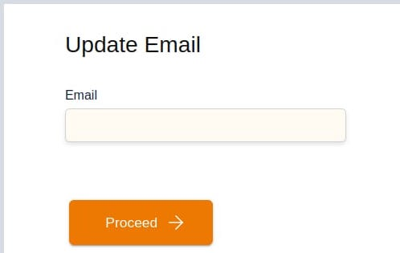
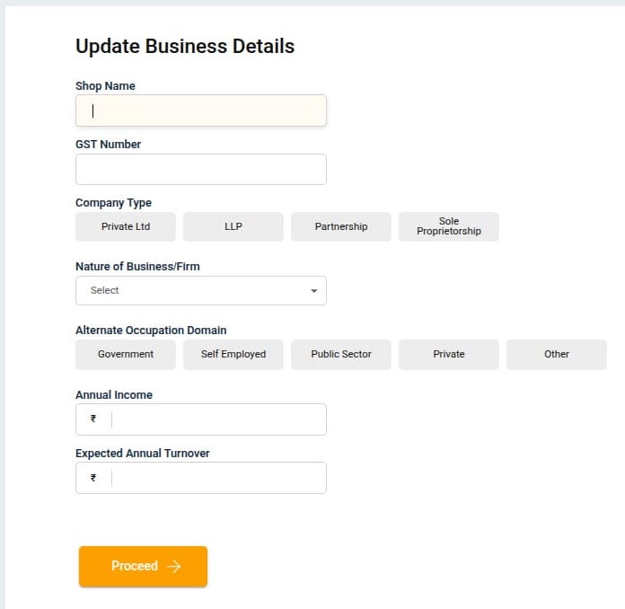
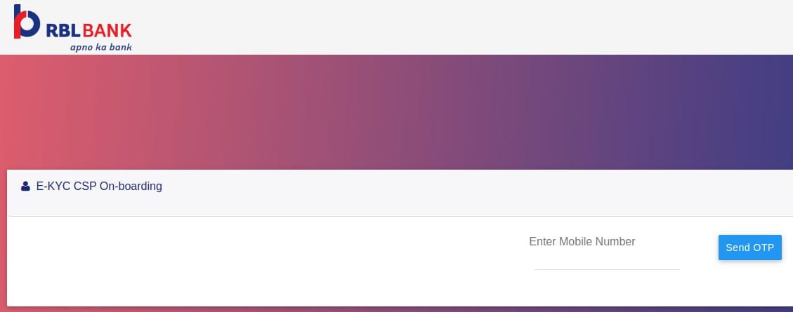

## What is Indo-Nepal Transfer?
Indo-Nepal Transfer is a cross-border remittance service that allows agents in India to send money to beneficiaries in Nepal securely and conveniently. The service ensures safe transactions, quick processing, and compliance with regulatory requirements.

---

## How to Register for Indo-Nepal Transfer?

To use Indo-Nepal Transfer, agents must first complete the registration and KYC process.

### Step 1: Verify Agent
- Go to the **Verify Agent** section and enter the required details (such as CSP code / mobile number).  

**Scenarios:**
- If the agent’s details are already verified → system redirects to **Search Customer**.  
- If the agent is available but not KYC-complete → option to **Initiate RBL KYC** will appear.  
- If the agent is not verified → system will redirect to **Update Profile**.  

---

### Step 2: Update Profile (For Not Verified Agents)

If the agent is not verified, the system will open the **Update Profile** screen. Complete the following details:

#### 1. Personal Details
Fields:  
- Name *(Required)*  
- Mobile Number  
- Alternate Mobile Number  
- Email ID  
- Date of Birth  
- Gender  
- Father’s Name  
- Spouse Name *(Optional)*  
- Marital Status  
- Physically Handicapped (Yes/No)  
- PAN Card Number  
- Education Qualification *(Dropdown)*  
- Category *(General/OBC/SC/ST/etc.)*  

After filling mandatory details, click **Proceed**.  

#### 2. Update Email
- Enter or confirm your **Email ID** and click **Proceed**.  

#### 3. Update Alternate Number
- Enter/verify **Alternate Mobile Number** → Click **Proceed**.  
- Enter OTP sent to the new number → Click **Proceed**.  
- Confirm with **Secret PIN** to finalize.  

  
  

#### 4. Address Details
- Address Line 1, Address Line 2, Pincode, City, District, State  
- Click **Proceed**  

#### 5. Bank Details
- Select Bank *(Required)*  
- Bank Account Number  
- Recipient’s Name  
- IFSC  
- Click **Proceed**  

#### 6. Business Details
- Shop Name  
- GST Number  
- Company Type *(Private Ltd / LLP / Proprietorship, etc.)*  
- Nature of Business *(Dropdown)*  
- Occupation Domain *(Govt / Private / Self Employed, etc.)*  
- Annual Income  
- Expected Annual Turnover  
- Mobile Number  

Click **Proceed**  

#### 7. Business Address
- Address Line 1, Address Line 2, Pincode, City, District, State  
- Click **Proceed**  

#### Final Verification
- An OTP will be sent to the registered mobile number.  
- Enter OTP to complete verification.  

Once verified, the agent becomes a **Verified Agent**.  

---

### Step 3: Initiate RBL KYC
- On the **Verify Agent** screen, click **Initiate RBL KYC**.  
- Aadhaar-based KYC page will open.  

#### Aadhaar Verification
- Enter Aadhaar Number/VID (twice)  
- Enter Date of Birth & Gender  
- Accept terms & conditions  
- Click **Submit** → then **OK**  

You will be redirected to **Verify Agent** screen. Click **Proceed**.  

  

---

### Step 4: Biometric Authentication
- Scan customer’s fingerprint using a supported device.  
- Retry if scan fails.  
- If biometric fails, a **Tech Support ticket** is created automatically.  

- If biometric succeeds → Confirmation screen appears.  

---

### Step 5: E-KYC CSP Onboarding
- Enter **CSP Mobile Number**  
- Click **Send OTP**  
- Enter OTP & Submit  
- On reaching **Thank You** screen → close the tab  

---

### Step 6: Final Proceed
- After KYC is completed → Click **Proceed**  
- System redirects to **Search Customer** screen  

---

## How to Do Indo-Nepal Transfer Transactions?

Once agent is verified & active:

1. Log in to the portal  
2. Select **Indo-Nepal Transfer**  
3. Enter beneficiary details:  
   - Full Name  
   - Mobile Number  
   - Bank Account Number *(if applicable)*  
   - Bank Name & Branch  
4. Enter transaction amount  
5. Review all details carefully  
6. Confirm & Proceed  
7. System generates a confirmation receipt  

---

## Key Points
- Agent verification & KYC are mandatory before transactions.  
- Ensure accurate beneficiary details to avoid delays/failures.  
- Keep transaction receipt for records.  

---

## FAQs

### What if profile update is required?
If agent details are not found during verification, system prompts **Update Profile** before proceeding.  

### How long does a transfer take?
Usually instant, but may take up to 24 hours depending on bank.  

### What if a transaction fails?
The amount is refunded back to the sender’s account within standard timelines.  
