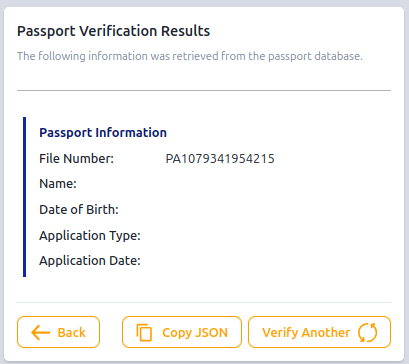
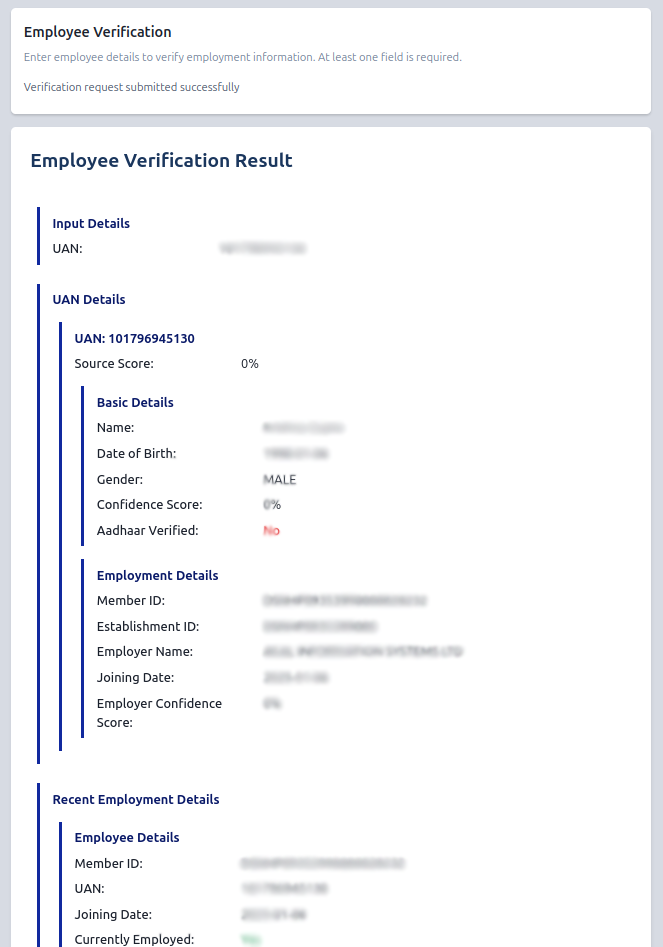
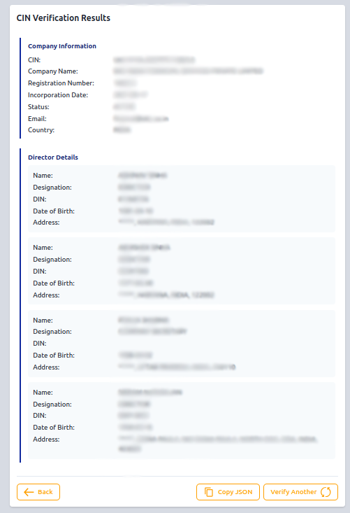
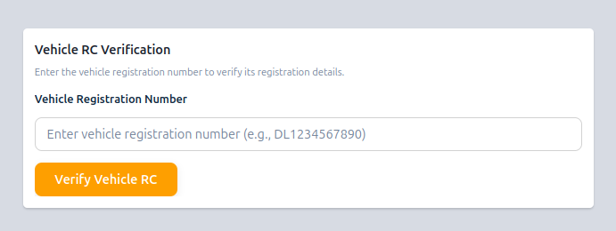
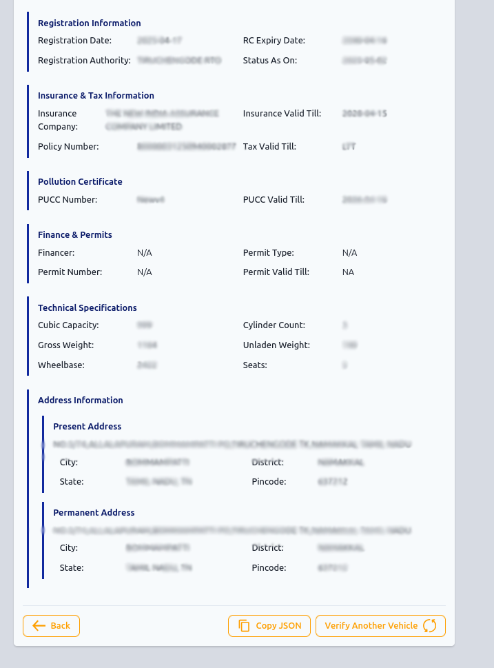
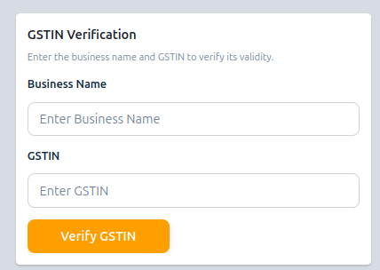
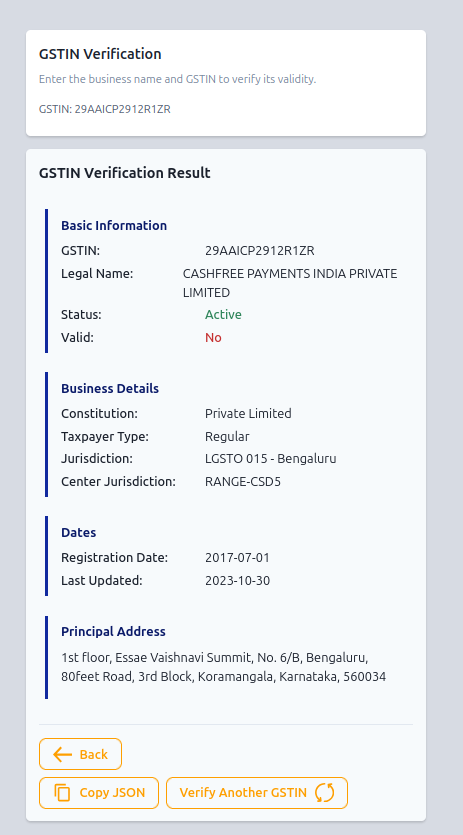
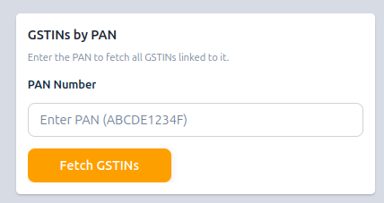

## 1. How to verify PAN?

We have two variations of PAN verification API: PAN Lite & PAN Advanced.

### 1.a. PAN Lite

#### What is PAN Lite Verification?
PAN Lite Verification is used to validates a user’s PAN number, name, and date of birth against the official database. It provides key details such as PAN status, name and DOB match results, and Aadhaar linking status.

#### Form Input
1. In the **PAN Number** field, enter the 10-character PAN (e.g., `ABCDE1234F`).
2. In the **Full Name** field, enter the cardholder’s name exactly as printed on the PAN.
3. In the **Date Of Birth** field, click the calendar icon and select the user’s DOB.
4. Click the **Verify PAN** button to submit.

#### Result

It shows the following information about the PAN holder:

| Name                   | Description                                                                 |
|------------------------|-----------------------------------------------------------------------------|
| PAN number             | The unique 10-character alphanumeric identifier of the individual issued by the Income Tax Department. |
| Name                   | The name of the individual as per the PAN information.                      |
| DOB                    | The date of birth of the individual as per the PAN information. |
| Name Match             | The result of name match verification. If the name entered matches with the name present in the PAN information, it showa Y, otherwise N. |
| DOB Match              | The result of the date of birth verification. If the date of birth of the individual matches with the date of birth present in the PAN information, it shows Y, otherwise N. |
| PAN Status Code        | The status of the PAN information. See the table below for details.         |
| Status                 | The status of PAN, either 'VALID' or 'INVALID'.                 |
| Aadhaar Seeding Status | Whether the individual linked the Aadhaar information with PAN. |
| Aadhaar Status Desc    | Additional information of the linking of Aadhaar and PAN cards. |

**Values for `PAN Status Code`:**
| PAN Status Code | Description                                                           |
|------------|----------------------------------------------------------------------------|
| E          | The entered PAN information is valid.                                      |
| EC         | The entered PAN information exists and is valid but marked as Acquisition. |
| N          | The entered PAN information does not exist in the database.                |
| X          | The entered PAN information has been deactivated.                          |
| F          | The entered PAN information is fake.                                       |
| D          | The entered PAN information has been deleted.                              |
| EA         | The entered PAN information is valid but marked as Amalgamation.           |
| ED         | The entered PAN information is valid but marked as Death.                  |
| EI         | The entered PAN information is valid but marked as Dissolution.            |
| EL         | The entered PAN information is valid but marked as Liquidated.             |
| EM         | The entered PAN information is valid but marked as Merger.                 |
| EP         | The entered PAN information is valid but marked as Partition.              |
| ES         | The entered PAN information is valid but marked as Split.                  |
| EU         | The entered PAN information is valid but marked as Under Liquidation.      |

### 1.b. PAN Advanced

#### What is PAN Advanced Verification?
PAN Advanced Verification offers comprehensive PAN-holder details, including contact information and KYC status, going beyond basic match checks. It provides verified personal information, address, Aadhaar linkage, and more for in-depth validation.

#### Form Input
1. Enter the 10-character PAN in the **PAN Number** field.
2. Type the cardholder’s exact name in the **Full Name** field.
3. Select the user’s birth date via the **Date Of Birth** calendar picker.
4. Click **Verify PAN** to fetch the advanced details.

#### Result

It shows the following information about the PAN holder:

| Name                           | Description                                     |
|--------------------------------|------------------------------------------------------|
| KYC Status                     | The current status of the `Know Your Customer` process |
| Personal Information           | Section containing personal details of the individual |
| PAN Number                    | The unique Permanent Account Number issued to the individual |
| Provided Name                 | The name as provided by the individual                |
| Registered Name               | The official name registered with the PAN authority  |
| First Name                   | The first name of the individual                       |
| Last Name                    | The last name or surname of the individual             |
| Gender                       | The gender of the individual                            |
| PAN Type                     | The type/category of the PAN issued                     |
| Date of Birth                | The date of birth of the individual                     |
| Contact Information          | Section containing contact details                      |
| Full Address                 | The complete residential or mailing address            |
| Country                      | The country of residence, e.g., India                   |
| Masked Aadhaar               | Partially hidden Aadhaar number for privacy             |
| Aadhaar Linked               | Indicates whether Aadhaar is linked to the PAN (Yes/No) |

.png)

---

## 2. How to do Passport Verification?

### What is Passport Verification?
Passport Verification validates a user’s passport file number and date of birth against the government database. It confirms the passport holder’s identity and application details.

### Form Input
- Select **Passport Verification**.
- Enter **File Number** as printed on the passport (e.g., PA1079341954215).
- Select **Date of Birth** of the individual.
- Optionally, enter the **Name** exactly as it appears on the passport.
- Click on the **Verify Passport** button to proceed.

### Result

It shows the following information about the Passport:

| Name                     | Description                                                      |
|--------------------------|------------------------------------------------------------------|
| File Number              | Unique alphanumeric code identifying the Passport application.   |
| Name                     | Name of the Passport holder.                                     |
| DOB                      | Date of birth of the Passport holder.                            |
| Application Type         | Type of Passport application.                                    |
| Application Date         | Date when the Passport application was received.                 |

---

## 3. How to do Employee Verification?

### What is Employee Verification?
Employee Verification confirms an individual’s employment details by matching submitted information with official records. It includes identity checks, UAN data, employment history, and Aadhaar verification information.

### Form Input

- You can fill any or all fields (Phone Number, PAN, UAN, Date Of Birth, Employee Name, Employer Name), but providing the **UAN** alone is sufficient.
- Once you’ve entered your data, click **Verify Employee** to submit.

### Result

The result screen shows a consolidated view of personal identity, employment history, recent activity, and employer verification—all tied to the UAN:

| Name                        | Description                                                    |
|-----------------------------|----------------------------------------------------------------||
| Source Score                | The reliability score of the data source                        |
| Name                        | Full name of the employee                                       |
| Date of Birth               | Employee's date of birth                                        |
| Gender                      | Gender of the employee                                          |
| Confidence Score            | Overall confidence level in the basic details verification      |
| Aadhaar Verified            | Status indicating if Aadhaar has been verified                  |
| Member ID                   | Unique membership identifier of the employee                    |
| Establishment ID            | Identifier for the employer or establishment                    |
| Employer Name               | Name of the employer or organization                            |
| Joining Date                | Date when the employee joined the organization                  |
| Employer Confidence Score   | Confidence score assigned by the employer on employee data     |
| Recent Employment Details   | Information about the latest employment status                  |
| Currently Employed          | Indicates if the employee is currently employed (Yes/No)        |

---

## 4. How to Verify CIN (Customer Identification Number)?

### What is CIN Verification?
CIN (Corporate Identification Number) Verification is used to retrieve verified company and director information by providing a valid CIN. It ensures accurate identification of registered companies in India and promotes transparency.

### Form Input
- Enter a valid Corporate Identification Number (CIN) in the input field.
- Click the **Verify CIN** button.

### Result
Upon successful verification, company and director details will be displayed, including company name, registration number, incorporation date:
| Name                  | Description                                                                                  |
|-----------------------|----------------------------------------------------------------------------------------------|
| Company Name          | Name of the company registered under the Ministry of Corporate Affairs.                      |
| Registration Number   | Registration number of the company.                                                          |
| Incorporation Date    | Date of incorporation of the company.                                                        |
| CIN Status            | Granular level status of the CIN information.                                                |
| Email                 | Email ID of the company registered under the Ministry of Corporate Affairs.                  |
| Country               | Country where the company is located.                                                        |
| Director Details      | Details of the directors associated with the company, each containing:                       |
|                       | 1. DOB – Date of birth of the director                                                       |
|                       | 2. Designation – Designation of the director                                                 |
|                       | 3. Address – Address information of the director                                             |
|                       | 4. DIN – Unique identification number assigned to the individual appointed as director       |
|                       | 5. Name – Name of the director                                                               |

---

## 5. How to Verify a Driving License?

### What is Driving License Verification?
It is used to authenticate a driving license by validating key information such as license number, date of birth, vehicle class, and validity details. It plays a crucial role in KYC and onboarding processes.

### Form Input

1. Enter the **Driving License Number**
2. Select the **Date of Birth**.
3. Click on the **Verify License** button.

### Result

After a successful verification the following details are displayed, including personal information, license status, validity period, address, and authorized vehicles:

| Name                      | Description                                                                                          |
|---------------------------|------------------------------------------------------------------------------------------------------|
| DOB                       | The date of birth of the individual as present in the driving licence.                              |
| Status                    | Whether the driving licence is valid.                                                               |
| Badge Details             | Details of badges associated with the driving licence, each containing:                             |
|                           | 1. Badge Issue Date – The date the badge was issued                                                 |
|                           | 2. Badge No – The number of the badge issued                                                       |
|                           | 3. Class of Vehicle – The class of the vehicle                                                     |
| DL Validity               | Information regarding the validity of the licence, including:                                       |
|                           | 1. Non Transport – Validity period (`from` and `to` dates)                                         |
|                           | 2. Transport – Validity period (`from` and `to` dates)                                             |
|                           | 3. Hazardous Valid Till – Validity for hazardous vehicle driving                                   |
|                           | 4. Hill Valid Till – Validity for driving in hill and mountain regions                             |
| Details of Driving Licence and personal information| Detailed information about the driving licence,and the individual including:                                         |
|                           | 1. Date of Issue – The date when the driving licence was issued                                    |
|                           | 2. Date of Last Transaction – The date of the last transaction                                     |
|                           | 3. Status – The current status of the driving licence                                              |
|                           | 4. Last Transacted At – The date of the last transaction recorded                                  |
|                           | 5. Name – The name of the individual                                                               |
|                           | 6. Father or Husband Name – The father’s or husband’s name of the individual                       |
|                           | 7. Address List – List of addresses with `complete_address`, `type`, and `split_address`           |
|                           | 8. Address – The address string                                                                    |
|                           | 9. Photo – The photo of the individual                                                             |
|                           | 10. COV Details – The details of the class of vehicle (COV)                                        |

.png)

---

## 6. How to Verify Vehicle RC (Registration Certificate)?

### What is Vehicle RC Verification?
Vehicle RC Verification is used to authenticate and retrieve the registration details of a vehicle using its registration number. This helps confirm the legitimacy, ownership, and legal status of the vehicle – crucial for compliance and KYC processes.

### Form Input

1. Enter the **Vehicle Registration Number** (e.g., `DL1234567890`).
2. Click on the **Verify Vehicle RC** button to proceed.

### Result

The following details of the vehicle are displayed, such as, owner name, registration date, vehicle class, fuel type, and validity:

| Name                            | Description                                                                                      |
|---------------------------------|--------------------------------------------------------------------------------------------------|
| Registration Date               | The date of registration of the vehicle.                                                         |
| RC Expiry Date                  | The date until which the registration of the vehicle is valid.                                   |
| Registration Authority          | The name of the registration authority.                                                          |
| Status As On                    | The particular date of the status of the RC.                                                     |
| Insurance Company               | The name of the insurance company associated with the vehicle.                                   |
| Insurance Valid Till            | The date until which the insurance of the vehicle is valid.                                      |
| Insurance Policy Number         | The insurance policy number of the vehicle.                                                      |
| Tax Valid Till                  | The date until which the vehicle tax is valid.                                                   |
| PUCC Number                     | The Pollution Under Control Certificate (PUCC) number.                                           |
| PUCC Valid Till                 | The validity date of the PUCC.                                                                   |
| Financer                        | The financial institution that financed the vehicle.                                             |
| Permit Number                   | The permit number of the vehicle.                                                                |
| Permit Type                     | The type of permit issued to the vehicle.                                                        |
| Permit Valid Till               | The end date of the permit validity.                                                             |
| Cubic Capacity                  | The engine's cubic capacity.                                                                     |
| Cylinder Count                  | The number of cylinders in the engine.                                                           |
| Gross Weight                    | The gross vehicle weight in kilograms.                                                           |
| Unladen Weight                  | The unladen vehicle weight in kilograms.                                                         |
| Wheelbase                       | The distance between the front and rear axles in mm.                                             |
| Seats                           | The number of seats in the vehicle.                                                              |
| Present Address                 | The current address of the owner, including city, district, state and pincode.                   |
| Permanent Address               | The permanent address of the owner, including city, district, state and pincode.                 |

---

## 7. How to Verify Voter ID?

### What is Voter ID Verification?
Voter ID Verification confirms the validity of an individual’s Electoral Photo Identity Card (EPIC) number by checking it against the election commission's database. This verification includes personal, constituency, and polling station details.

### Form Input

- Enter the **EPIC Number** as printed on the Voter ID card (e.g., TXL1456136).
- Optionally, enter the **Name** of the voter for additional verification.
- Click on the **Verify Voter ID** button to proceed.

### Result

- After submission, the **Voter ID Verification Result** screen will appear.
- It displays the verified voter details such as name, age, gender, father’s name, address, and constituency information.
- Please refer to the content table below.

| Name                             | Description                                                                                   |
|----------------------------------|-----------------------------------------------------------------------------------------------|
| Name                             | Name of the individual as present in the voter ID card.                                       |
| Name in Regional Language        | Name of the individual in the individual’s regional language as present in the voter ID card. |
| Age                              | Age of the voter ID holder as present in the voter ID card.                                   |
| Gender                           | Gender of the individual as present in the voter ID card.                                     |
| Father Name                      | Father’s name of the individual as present in the voter ID card.                              |
| Father Name in Regional Language | Father’s name in the individual’s regional language as present in the voter ID card.          |
| DOB                              | Date of birth of the individual as present in the voter ID card.                              |
| Address                          | Address of the individual as present in the voter ID card.                                    |
| EPIC Number                      | EPIC number of the individual as present in the voter ID card.                                |
| State                            | Name of the state as present in the voter ID card.                                            |
| Assembly Constituency Number     | Number associated with the assembly constituency as present in the voter ID card.             |
| Assembly Constituency            | Name of the assembly constituency as present in the voter ID card.                            |
| Parliamentary Constituency Number | Number associated with the parliamentary constituency as present in the voter ID card.       |
| Parliamentary Constituency       | Name of the parliamentary constituency as present in the voter ID card.                       |
| Part Details                     | Combination of part number and part name in the electoral roll.                               |
| Serial Number                    | Serial number as present in the voter ID card.                                                |
| Polling Station                  | Place where the individual is registered to cast votes during elections.                      |

---

## 8. How to Verify GSTIN?

### 8.a. GSTIN Verfication

#### What is GSTIN Verification?
this service is used to validate a business’s GSTIN (Goods and Services Tax Identification Number) by cross-referencing it with the official GST database. It confirms the authenticity, registration status, and associated details of the business.

#### Form Input

- Enter **Business Name** as registered for GST.
- In the **GSTIN** field, enter the 15-digit GST number (e.g., 06AANCB4495L1Z2).
- Click on the **Verify GSTIN** button to proceed.

#### Result

Upon successful verification, it displays the verified GST details such as business name, registration status, GSTIN, state, and registration type:

| Name                        | Description                                                                                      |
|-----------------------------|--------------------------------------------------------------------------------------------------|
| GSTIN                       | The `Goods and Services Tax Identification Number` of the business.                              |
| Legal Name of Business      | The legal name of the business as registered under GST.                                          |
| GSTIN Status                | The current status of the GSTIN (e.g., Active, Cancelled).                                       |
| Valid                       | Indicates whether the GSTIN is valid (Yes or No).                                                |
| Constitution of Business    | The type or constitution of the business (e.g., Private Limited, Proprietorship, etc.).          |
| Taxpayer Type               | The type of taxpayer (e.g., Regular, Composition, Casual).                                       |
| State Jurisdiction          | The name of the state-level tax office that has jurisdiction over the business.                 |
| Center Jurisdiction         | The name of the central tax office that has jurisdiction over the business.                     |
| Date of Registration        | The date when the business was registered under GST.                                             |
| Last Update Date            | The most recent date on which the GSTIN details were updated.                                   |
| Principal Place Address     | The primary address of the business as registered under GST.                                     |

### 8.b. Fetch GSTINs linked to a PAN

#### What is GSTINs by PAN?
The service enables retrieval of all active GST registrations linked to a specific PAN (Permanent Account Number). This helps identify every business entity registered under that PAN across different states or jurisdictions.

#### Form Input

- Enter the 10-character **PAN** (e.g., ABCDE1234F).
- Click on the **Fetch GSTINs** button to proceed.

#### Result

Upon successful validation of the PAN, it shows a list of all linked GSTINs with the following details.

| **Name**                 | **Description**          |
|--------------------------|--------------------------|
| GSTIN        | The GSTIN linked to the PAN          |
| Status       | The status of the GSTIN (eg, ACTICE) |
| State        | The name of the state where the GSTIN is registered |

