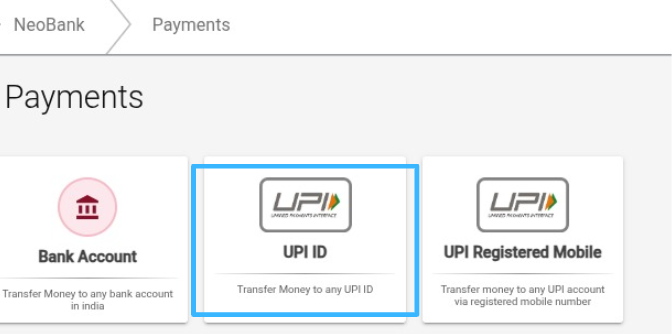
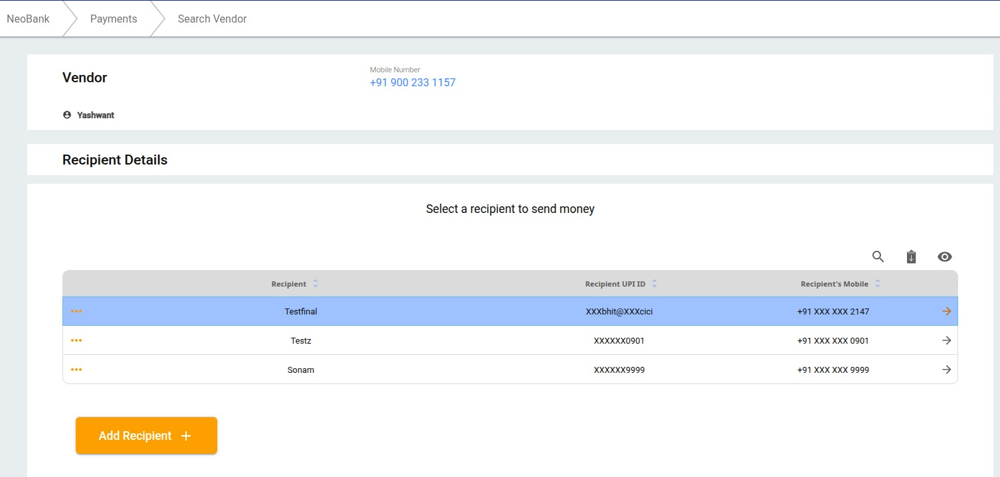
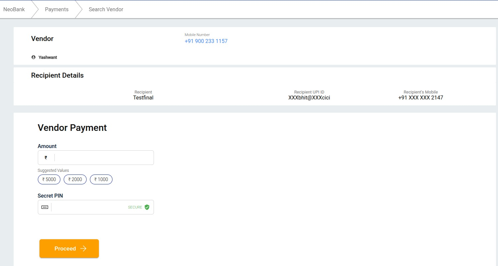

## What is UPI ID Payment?

This service allows you to send money instantly to your vendors' bank account using their UPI ID (like name@bank or 123456789@upi), without needing to know their bank account numbers.

Eko acts as a secure and compliant intermediary platform that allows agents to initiate UPI payments to vendors. Eko handles verification, fund routing, transaction authentication, and provides real-time settlement while ensuring data privacy and system integrity.

## How to do UPI ID Payment?

### Step 1: Select UPI ID Option  
Start the transaction by selecting the **“UPI ID”** payment option.

- **Verify UPI App Linkage:** Confirm that the recipient's mobile number is correctly linked to a UPI-enabled application.

### Step 2: Enter Vendor Mobile Number  
Input the **vendor’s mobile number** associated with the payment request.

### Step 3: Select or Add Recipient  
- Choose the desired recipient from the existing list.  
- If the recipient does not exist, proceed to add a new recipient.

### Step 4: Add Recipient Details  
Enter the following:  

- **Recipient’s Mobile Number**  
- **Recipient’s Name**  
- **Select the appropriate UPI App**  
- **Enter the UPI ID of the recipient**

### Step 5: Execute Vendor Payment  
- Enter the **payment amount** to be transferred.  
- Input the **agent’s secret PIN** to authorize and complete the payment.

## Key Points to Remember

- **Ensure correct UPI ID:** Always double-check the UPI ID before initiating the payment to prevent failed or misdirected transactions.
- **Confidentiality of Agent PIN:** Do not share your agent secret PIN. It is required to securely authorize UPI payments.
- **Accurate Recipient Information:** Carefully review recipient details when adding or selecting recipients to avoid errors.