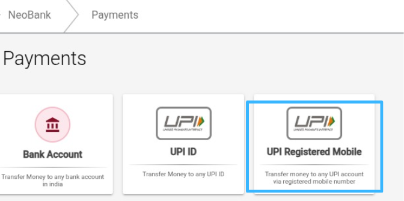
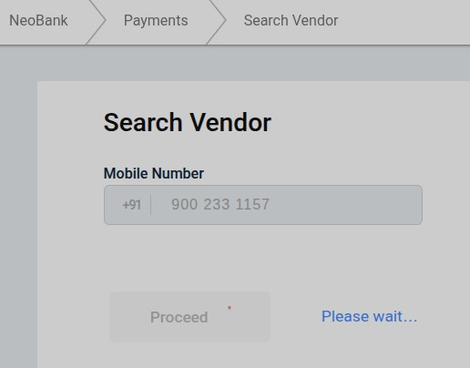
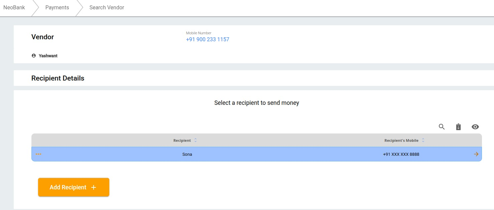
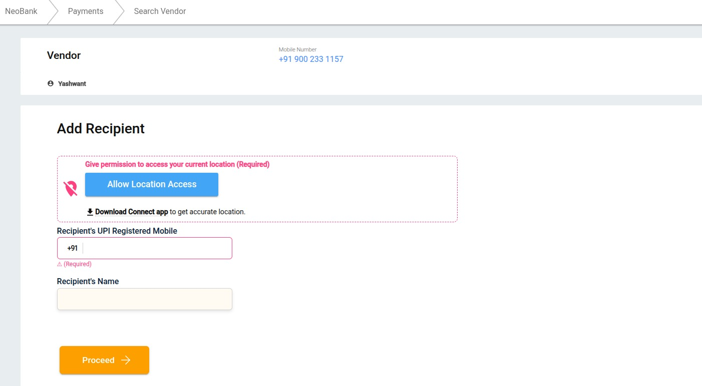
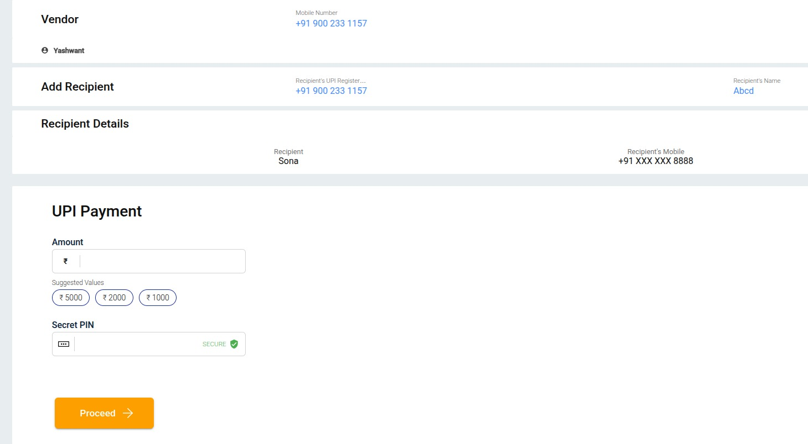

## What is UPI Payment and How Eko Handles It
UPI (Unified Payments Interface) is a real-time payment system developed by NPCI, enabling users to transfer money instantly between bank accounts via mobile using UPI ID or UPI-linked mobile number.
Eko acts as a secure and compliant intermediary platform that allows agents to initiate UPI payouts to vendors. Eko handles verification, fund routing, transaction authentication, and provides real-time settlement while ensuring data privacy and system integrity.

## Start with UPI VPA Payout 

### Step 1: Select UPI VPA Option  
Start the transaction by selecting the **“UPI ID”** payout option on the platform.

### Step 2: Enter Vendor Mobile Number  
Input the **vendor’s mobile number** associated with the payout request.

### Step 3: Select or Add Recipient  
- Choose the desired recipient from the existing list.  
- If the recipient does not exist, proceed to add a new recipient.

### Step 4: Add Recipient Details  
Input the following:  
- **Recipient’s Mobile Number**  
- **Recipient’s Name**  
- **Select the appropriate UPI App**  
- **Enter the UPI ID of the recipient**

### Step 5: Execute Vendor Payment  
- Enter the **payment amount** to be transferred  
- Input the **agent’s secret PIN** to authorize and complete the payment

## Start with UPI Mobile Payout

### Step 1: Select UPI Registered Mobile Option  
Initiate the process by selecting the **“UPI Registered Mobile”** payout option.

### Step 2: Enter Vendor Mobile Number  
Input the **vendor’s mobile number** for whom the payout is being initiated.

### Step 3: Select or Add Recipient  
- Select the recipient from the list if already added.  
- If not available, proceed to add a new recipient.

### Step 4: Add Recipient Details  
Enter the following:  
- **UPI Registered Mobile Number**  
- **Recipient Name**  
- **Enable and allow Location Access**  
- **Click on Proceed**

### Step 5: Execute Vendor Payment  
- Enter the **payment amount** as specified by the vendor  
- Enter the **agent’s secret PIN** to authorize and complete the payout
